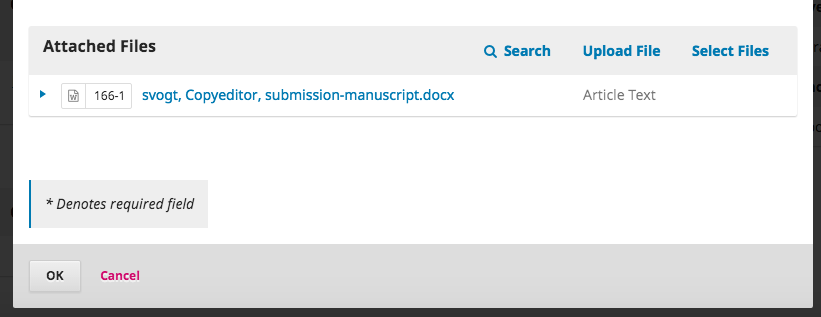

# Edição de texto

Quando uma submissão é aprovada na Etapa de Revisão, passa automaticamente para a etapa de Edição de texto.

##Adicionar um Editor de Texto

Quando a submissão entra na Etapa de Edição de texto, uma notificação indica que é necessário designar um Editor de texto. Os Editores de texto podem ser designados clicando em *Designar* no painel dos Participantes.

Esta ação irá abrir uma nova janela.

No menu Localizar um Utilizador, pode escolher Editor de texto e clicar em **Pesquisar**. Irá aparecer uma lista com todos os Editores de texto.

Selecione um dos Editores de texto para esta submissão.

Escolha uma mensagem preparada.

Faça as alterações necessárias à mensagem.

Clique em **Ok**.

Agora já poderá ver a notificação de que a submissão se encontra a aguardar a edição de texto, o Editor de texto já está incluído na lista de Participantes, e a solicitação está visível nas Discussões de edição de texto.

Agora pode aguardar que o Editor de texto faça o seu trabalho.

##Editor de texto

O Editor de texto irá receber uma mensagem de e-mail a solicitar que faça a revisão de texto da submissão.

Para dar início a este processo, o Editor de texto deverá autenticar-se no sistema e procurar a submissão no seu perfil.

Depois, pode clicar em Edição de texto à frente do título da submissão. Esta ação irá direcioná-lo diretamente para a etapa de Edição de texto desta submissão.

Aqui, poderá visualizar os Ficheiros de Rascunho. Estes são os ficheiros que necessitam de edição de texto. Ao clicar no título dos ficheiros, irá iniciar a sua transferência para o seu computador.

Fora do OJS, poderá efetuar o seu trabalho de edição de texto. 

Para verificar os metadados da submissão, use o link Metadados na barra azul no canto topo.

Nesta página poderá verificar o título do artigo, resumo, nome(s) do(s) autor(es), palavras-chaves, etc.

Se realizar alguma alteração, clique em **Guardar** antes de fechar a página.

###Consultar o Autor

Uma vez terminada a edição de texto, o Editor de texto deverá discutir as alterações com o Autor, abrindo uma nova discussão, utilizando o link *Adicionar discussão* no painel das Discussões de edição de texto

Na janela de Adicionar discussão, o Editor de texto deve escolher o autor e adicionar o assunto e o texto da mensagem.

Mais abaixo na mesma página, pode transferir uma cópia do ficheiro em que fez as revisões de texto.

Para isso, use o link *Upload Ficheiro*. Esta ação irá abrir uma nova página onde pode escolher o *Componente do Trabalho*(ex. Artigo) e transferir o ficheiro.

Clique em **Continuar** para prosseguir.

Continuamos para o passo seguinte, onde pode ser editado o nome do ficheiro se for necessário.

Em seguida, pode transferir mais ficheiros se for necessário, ou clicar em **Concluir**.

De volta à página de Adicionar discussão, já consegue ver os ficheiros anexados.

Clique em **OK** para enviar a mensagem ao autor.

Já se encontra visível no painel de Dicussões de edição de texto.

Agora é só aguardar pela resposta do autor.

##O Autor Responde

Quando receber a resposta do autor, pode ler as considerações do autor na resposta à discussão.

A partir daqui, não são necessárias mais alterações.

##Ficheiro final de edição de texto

Agora pode transferir o ficheiro final de edição de texto para o painel de Edição de texto, no final da página.

Use o link Transferir/Selecionar Ficheiros para enviar para o sistema a versão final da edição de texto.

É importante notar que aqui tem diferentes opções:

1. Pode usar o link Transferir Ficheiro para transferir um novo ficheiro (ex. um ficheiro com alterações recentes desde que iniciou a discussão com o autor);
2. Pode selecionar a versão original do Autor (improvável);
3. Pode selecionar a versão do Editor de Texto, que é a versão revista que enviou ao autor (caso não tenha feito mais alterações, escolha esta opção).

Para esta demonstração, selecionámos a versão do Editor de texto **selecionando a caixa** à esquerda desse ficheiro.

Clique em **OK**.

O ficheiro agora encontra-se visível no painel *Edição de texto* (no final da página), indicando ao editor que esta é a versão final, a qual se encontra pronta para seguir para a etapa de Produção.

##Informar o Editor de Secção

O passo final é informar o Editor de Secção que a tarefa de edição de texto se encontra concluída.

Para isso, inicie uma nova Discussão de edição de texto clicando em *Adicionar Discussão*.

Na página da discussão, adicione o Editor de Secção, o assunto e a mensagem.

Clique em **OK** para enviar a mensagem.

Ao regressar à etapa de Edição de texto, já consegue ver a mensagem publicada.

O seu trabalho como Editor de Texto encontra-se concluído!

##Seguindo para Produção

O Editor de Secção recebe um e-mail a informar que a edição de texto se encontra concluída, e vê a notificação nas discussões.

Pode transferir e rever a versão final de edição de texto no painel de Edição de Texto.

Neste ponto, pode continuar a comunicação com o Editor de texto, ou, se considerar que a tarefa está terminada, seguir para a etapa de Produção.

Para tal, clique no botão azul à direita **Enviar para Produção**.

Esta ação irá gerar uma notificação oficial para os Autores para os informar que a submissão vai seguir para a próxima etapa.

Repare que o ficheiro apropriado, que se encontra no painel de Edição de texto, encontra-se incluído e será automaticamente transferido para a Produção.

Clique em **Gravar Decisão Editorial** para continuar.

A etapa de Edição de texto encontra-se agora concluída.