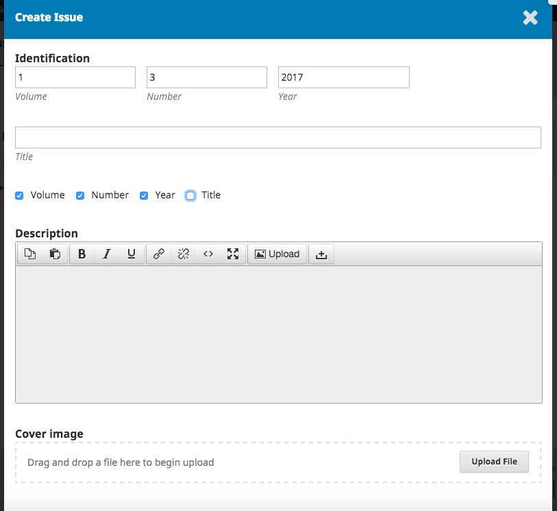
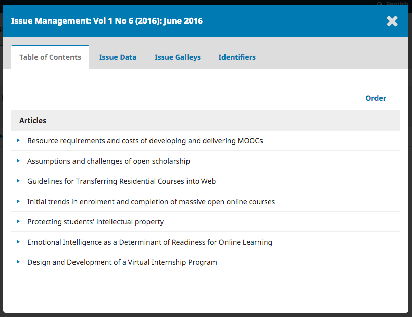

# Edições Futuras

As edições futuras são todas as edições ainda não publicadas. Pode criar tantas quantas pretender, e agendar submissões para qualquer uma das criadas.

### Criar Número

Para criar um novo número, clique em **Criar Número** e preencha o formulário.

Existem espaços para adicionar o volume, número, ano, e o título do número \(ex., Número Especial \#1\), bem como uma breve descrição e a imagem da capa \(se necessário\).

### Editar Número

Também pode editar uma edição futura existente, selecionando a seta azul à esquerda do número na página de Edições Futuras.

Esta ação irá revelar o link Editar, o que irá abrir uma nova janela com informação.

**Sumário**: Para uma nova edição, esta aba aparecerá vazia, mas para edições que já tenham submissões agendadas, aparecerá a lista destas submissões aqui.

Utilize a seta azul no início de cada submissão para revelar os links que direcionam diretamente para o registo da submissão \(para mais informação sobre este assunto ler  Capítulo 10\) ou que o eliminam.

Pode ainda clicar em Ordenar para reorganizar a ordem das entradas.

**Dados da Edição**: Esta aba fornece acesso aos dados do volume, número, data, que inseriu quando criou o número.

**Versões finais do Número**: Esta opção permite-lhe inserir uma composição final do número completo -- ex., um PDF com todos os artigos. Isto ficará disponível na página do número.

**Identificadores**: Use este espaço para atribuir um DOI à edição, caso a sua revista suporte identificadores de edições.

### Pré-visualizar Edição

Ao usar a mesma seta azul também revelará um link para Pré-visualizar, dando a oportunidade de visualizar a edição antes de a publicar.

### Publicar Edição

Quando considerar que a edição está pronta para publicação, clique em Publicar Edição para a publicar no site da revista.

### Eliminar Edição

O link Eliminar serve para remover por completo a edição. Quaisquer artigos que estejam agendados numa edição que seja eliminada irá reverter para o estado de não publicado.