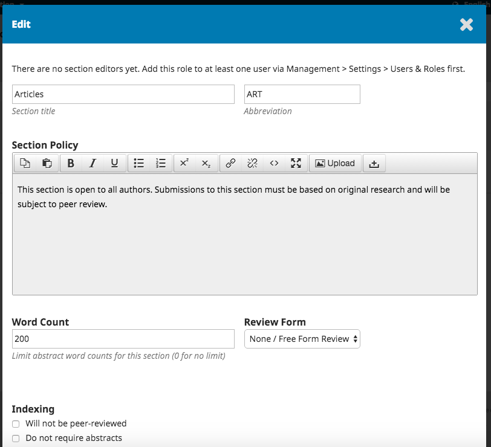
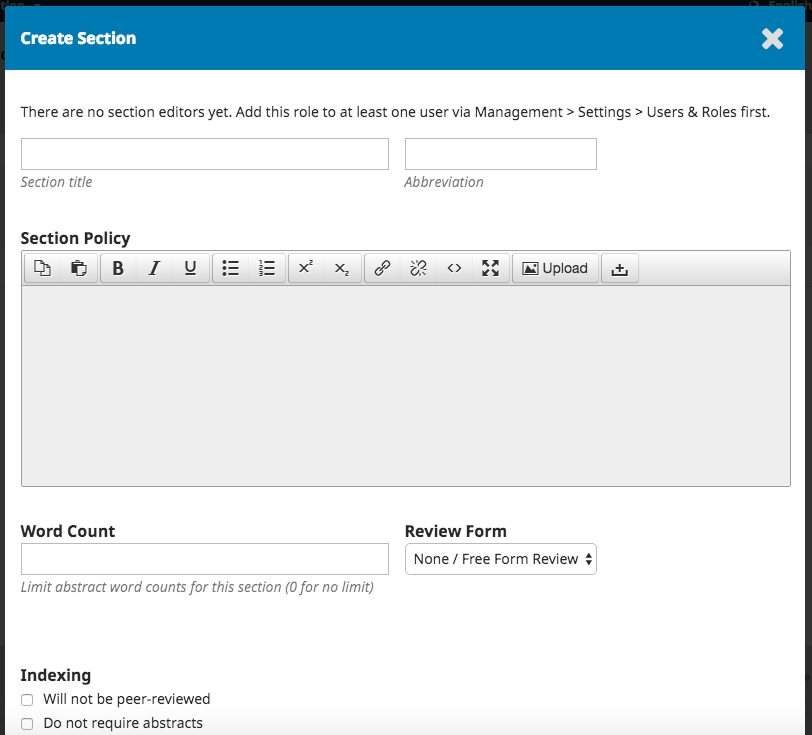

# Configurações da Revista

A página das Configurações da Revista inclui detalhes sobre a revista. 

Use as abas para navegar nas diferentes secções das Configurações da Revista: Cabeçalho, Contacto, Secções.

## Cabeçalho

**Nome da Revista** é o título da revista. Ex., Revista de Documentação de Software

**Sigla da Revista** são as iniciais da revista. Ex., RDS.

**Abreviatura da Revista** é uma versão abreviada do título da revista. Ex., RDocSof.

**Editora** é o nome da organização que publica a revista.

**ISSN** \(International Standard Serial Number\) é um número constituído por oito algarismo que identifica revistas.É gerido por uma rede internacional de Centros Nacionais coordenados pelo Centro Internacional localizado em Paris. , apoiado pela Unesco e o Governo Francês. Este número pode ser obtido através do [site do ISSN](http://www.issn.org/). Esta número pode ser solicitado a qualquer momento da gestão da revista.

As revistas publicadas através do OJS geralmente têm um e-ISSN, mas algumas podem também publicar uma versão impressa, o que requer um ISSN impresso diferente.

**Resumo da Revista** é uma breve descrição da revista. Se se encontra numa instalação do OJS com várias revistas, este texto aparecerá na lista de revistas, junto ao nome da sua revista.

**Equipa Editorial** permite-lhe inserir os nomes da sua equipa editorial ou qualquer pessoa que pretenda mencionar. Esta informação aparece no site público em Sobre &gt; Equipa Editorial.

**Sobre a Revista** é um campo para adicionar informação sobre a revista que possa ser do interesse dos leitores, autores ou revisores.

Esta informação pode incluir política de acesso aberto, âmbito da revista, direitos de autor, patrocínios, histórico da revista, declaração de privacidade, e inclusão de sistema de arquivo LOCKSS ou CLOCKSS.

Clique em **Guardar** para gravar as alterações.

## Contacto

Use esta secção para inserir os contactos da revista.

**Endereço postal**: Insira o endereço postal oficial. Esta informação aparecerá na página da revista em Contacto.

**Contacto Principal**: Adicione a informação de contacto da pessoa de contacto principal.

**Contacto de Suporte Técnico**: Insira a informação de contacto para a pessoa responsável por suporte técnico. Esta informação aparecerá na página da revista em Contacto e também em diferentes pontos do processo editorial para oferecer apoio aos utilizadores.

Clique em **Guardar** para gravar as alterações.

## Secções

Nesta página, poderá configurar as diferentes secções da revista. Ex., Artigos, Editoriais, Revisões, Comentários, etc.

Todas as secções existentes aparecerão aqui. O OJS requere existir pelo menos uma secção, e por isso criar uma secção "Artigos" por padrão.

Pode modificar secções ao clicar na seta azul à esquerda do nome da secção. Esta ação irá revelar opções para editar ou eliminar a secção.

### Editar uma Secção

Ao selecionar o link de editar irá abrir uma nova janela com diferentes opções de configuração.

Nesta página, pode alterar o nome ou abreviatura da secção.

**Política da Secção**: Use este campo para adicionar detalhes importantes como requisitos das submissões, revisão por pares, etc.

**Contar Palavras**: Insira neste campo o número máximo de palavras dos resumos da submissões a esta secção.

**Formulário de Revisão**: Pode selecionar um formulário de revisão específico para cada secção. Saiba mais Formulários nas Configurações do Fluxo de Trabalho.

**Indexação**: Cada secção pode ter diferentes configurações de indexação. Por exemplo, uma secção Editorial geralmente não é revista por pares.

**Como metadado do artigo, identificar itens nesta secção como \(n\)**: Este campo é usado para sistemas agregadores. Note que não é um campo obrigatório.

Clique em **Guardar** para gravar as alterações e regressar à página das Secções.

### Criar Secção

Na página das Secções, selecione Criar Secção para abrir uma janela em branco, igual à janela usada para editar uma Secção descrita acima.

Preencha os detalhes e clique em Guardar para gravar o seu trabalho.

### Ordenar Secções

Quando tem mais do que uma seção, poderá visualizar um link de Ordenar. Use este link para reordenar as secções da revista.

Clique em Concluído quando terminar de reorganizar as secções.

