# Produção

Quando a etapa de Edição de Texto se encontra concluída, a submissão segue para a Produção. Aqui, os ficheiros de edição de texto \(geralmente ficheiro do Microsoft Word\) serão convertidos em formatos de publicação  \(ex., PDF, HTML\) e feita a revisão de provas antes de serem publicados.

Para iniciar o trabalho na Produção, o Editor de Secção deve autenticar-se no sistema e selecionar a submissão no seu dashboard.

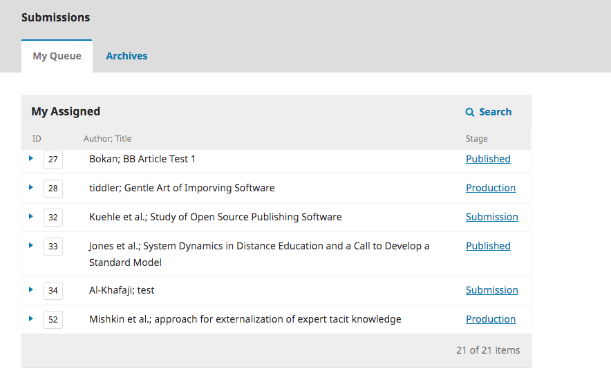

Ao escolher o link de Produção irá abrir o registo da submissão.

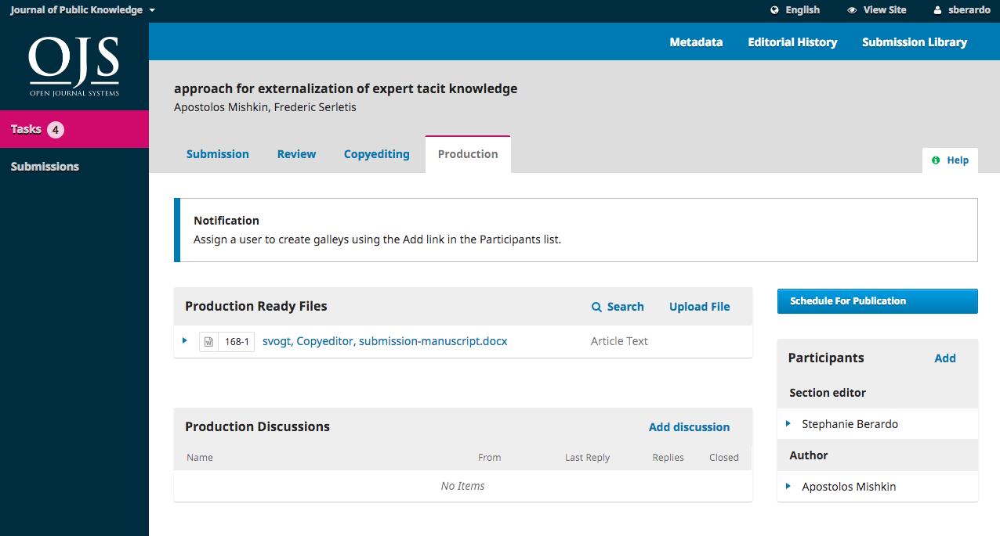

Verá que os ficheiros de edição de texto já se encontram disponíveis no painel _Ficheiro Prontos para Produção_.

Um banner de notificação indica que é necessário designar alguém para criar as composições finais \(ex., os PDFs, HTML, etc.\) a partir destes ficheiros prontos para produção.

Esta etapa pode variar de revista para revista -- pode ter editores de layout ou assistentes de produção para realizar esta tarefa.

Para designar a pessoa a efetuar a tarefa, clique em _Designar_ na lista de Participantes. Esta ação irá abrir uma nova janela.

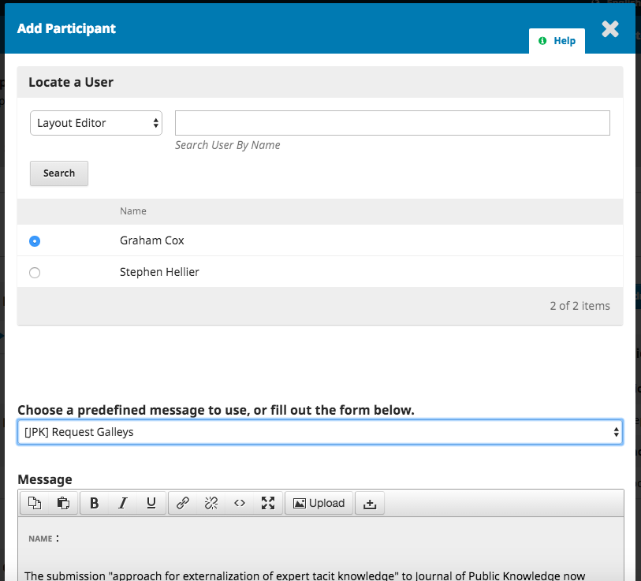

Utilize o menu de papéis e botão de pesquisa para encontrar os utilizadores apropriados, selecione um utilizador, escolha uma mensagem pré-definida, e clique em **OK** para enviar.

O utilizador foi notificado por e-mail e no seu dashboard.

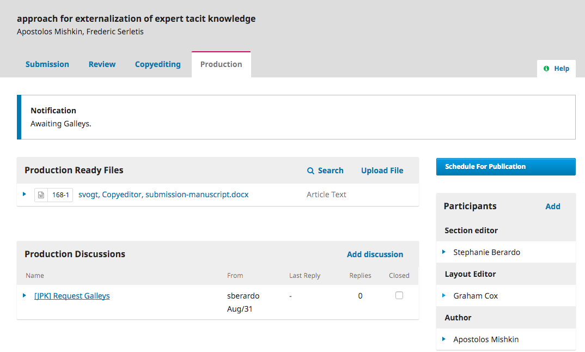

Repare que agora a notificação indica que a submissão encontra-se "A aguardar composições finais". Pode ver o editor de layout na lista de Participantes, e pode visualizar a mensagem de solicitação no painel de Discussões da Produção.

Agora é só aguardar que o Editor de Layout termina as suas tarefas.

## Edição de Layout

Como Editor de Layout, irá receber uma mensagem a convidá-lo a criar as composições finais para a submissão.

Para iniciar, autentique-se no sistema e vá ao seu dashboard.

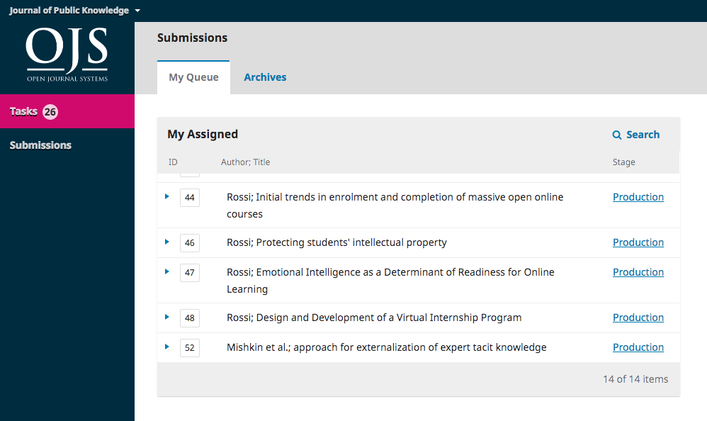

Aqui, procure a submissão e selecione o link de Produção.

Esta ação irá redirecioná-lo para o registo da submissão.

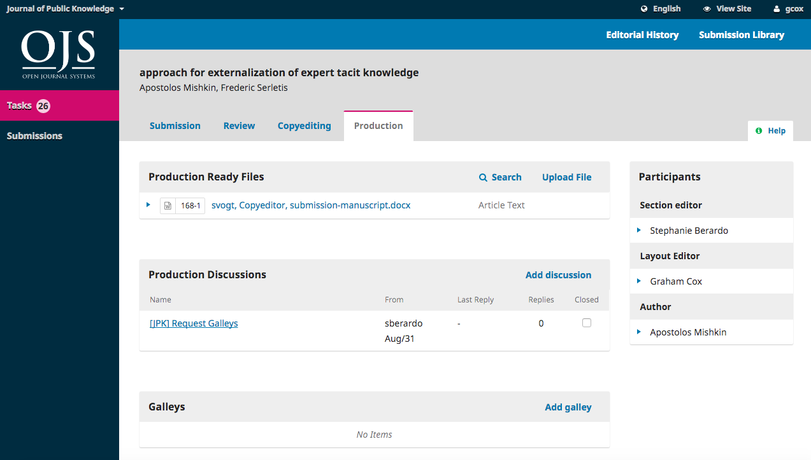

No painel dos Ficheiros Prontos para Produção, descarregue os ficheiros para o seu computador e trabalhe fora do OJS convertendo-os para os formatos apropriados para a sua revista \(ex., HTML, PDF, etc.\).

> Nota: o PKP encontra-se atualmente a desenvolver um projeto de conversão automática de documentos do Microsoft Word para outros formatos, incluindo XML, HTML, PDF, EPUB, etc. Esteja atento ao nosso blog para novas atualizações.

## Decisão sobre os Formatos de Ficheiros dos Artigos

Revistas online hoje em dia publicam os artigos numa grande variedade de tipos de ficheiros. Os formatos mais comuns são o PDF e o HTML, mas cada vez mais formatos adicionais estão a ser usados, como ePub, MP3, e XML.

A maioria das submissões dos autores são documentos do Microsoft Word \(.doc ou .docx\), e geralmente passam por todo o processo editorial no OJS \(revisão, edição de texto, revisão de provas\) nesse formato. Outros formatos submetidos às vezes são o text \(.txt\), rich text format \(.rtf\), ou Open Office \(.odt\). Estes formatos não são apropriados para publicação final, portanto terão de ser convertidos em formatos apropriados para leitura. 

#### Utilizar Templates

Exigir que todas as submissões usem um template pré-formatado com os estilos de publicação da revista \(ex., fonte, tamanho de letra, negritos, localização, etc. do cabeçalho, corpo de texto, rodapés, etc.\) torna a conversão do documento mais fácil.

A Microsoft fornece uma breve visão de como criar templates [aqui](https://www.gitbook.com/book/pkp/ojs3/edit#).

Quando tiver um template que corresponda ao estilo da revista, deverá inseri-lo nas Diretrizes para Autores, junto com uma breve descrição da necessidade de utilização do template. Isto significa que todas as submissões que receber já virão formatadas, poupando bastante tempo ao editor de layout.

Encontra aqui um exemplo de uma revista publicada através do OJS que obriga os autores a utilizarem um ficheiro template: [Paideusis](https://journals.sfu.ca/pie/index.php/pie#authorGuidelines).

Idealmente, o template deve ser criado usando estilos em vez de formatação direta. Isto assegura consistência em todos os documentos, mas também irá ajudar na conversão para outros formatos \(ex., HTML\). Veja aqui uma [explicação sobre a diferença entre estilos e formatação direta no Word](https://support.office.com/en-us/article/Style-basics-in-Word-d382f84d-5c38-4444-98a5-9cbb6ede1ba4?CorrelationId=1b00844c-a9dc-4d62-98df-a966f30d4b20&ui=en-US&rs=en-US&ad=US&ocmsassetID=HA010230882).

#### Criar ficheiros PDF

Um PDF é o tipo de ficheiro mais fácil de criar a partir de um documento Word. As versões atuais do Microsoft Word \(e outros processadores de texto\) permitem simplesmente "Guardar como" PDF. A maioria das revistas do OJS publicam os seus artigos em PDF.

PDFs também são muito populares entre os leitores, uma vez que são bastante fiáveis aos artigos impressos. No entanto, os PDFs são menos flexíveis em dispositivos móveis e nem sempre permitem links ou multimedia embebida \(tal como ficheiros de som ou vídeo\). Com a importância crescente da computação móvel, assegurar que a sua audiência consegue facilmente ler os artigos no seus telefones ou tablets é cada vez mais importante.

Exemplo \(veja o link do PDF no final da página\): [Irish Journal of Technology Enhanced Learning](http://www.journal.ilta.ie/index.php/telji/article/view/22/51)

#### Criar ficheiros HTML

Os ficheiros em HTML têm a vantagem da flexibilidade. Permitem facilmente links e multimedia, e cabem em qualquer écrã - incluindo telefones e tablets. No entanto, a sua aparência é diferente da de uma página impressa, por isso alguns leitores continuam a preferir os PDFs. A situação ideal é fornecer tanto ficheiros em PDF como em HTML para ir ao encontro das necessidades de diferentes utilizadores.

Na secção anterior vimos que criar um PDF a partir de um documento Word é fácil. Infelizmente, criar ficheiros HTML demora bastante mais tempo. Os processadores de texto não têm ferramentas para "Guardar como" HTML. O Microsoft Word tenta efetuar esta conversão, mas os resultados não são úteis para disponibilizar no OJS. Em alternativa, tente este procedimento:

1. Converter o documento Word. Pode utilizar esta [ferramenta gratuita online](https://word2cleanhtml.com/) para realizar uma conversão inicial.
2. Abra os ficheiros HTML da conversão num editor de texto \(ex., NotePad do Windows\) ou editor de HTML \(ex., Adobe Dreamweaver\). Será necessário efetuar alguma limpeza final ou formatação. Saber código HTML básico é obrigatório. No entanto não é difícil e existem bastantes [tutoriais gratuitos](https://www.w3schools.com/html/), mas demora algum tempo.
3. Mantenha a formatação do HTML básica. Concentre-se apenas nos parágrafos, quebras de linha, cabeçalhos, e links. Não se preocupe com as fontes, cores, ou outros elementos de design - o OJS formata estes elementos automaticamente como parte do design geral da revista. 
4. Envie a composição final HTML para o OJS

Exemplo \(veja o link HTML no final da página\): [Forum Qualitative Sozialforschung](http://www.qualitative-research.net/index.php/fqs/article/view/2577)

#### Criar ficheiros ePub

Tal como com os ficheiros HTML files, os ficheiros ePub são ideais para dispositivos móveis, mas requerem programação especial para os criar. Existem ferramentas de conversão, tal como [Calibre](https://calibre-ebook.com/). Mais informação sobre COMO FAZER para criar ficheiros ePub encontram-se [disponíveis aqui](https://www.wikihow.com/Convert-a-Word-Document-to-Epub).

Tal como os ficheiros HTML, pode ser necessária alguma limpeza adicional depois da conversão o que [requere algum conhecimento](http://www.jedisaber.com/eBooks/Introduction.shtml) sobre o formato.

Exemplo \(veja o link EPUB no final da página\): [International Review of Research in Open and Distance Learning](http://www.irrodl.org/index.php/irrodl/article/view/2895)

#### Criar ficheiros Áudio

Apesar de não ser comum, algumas revistas também criam ficheiros áudio dos seus artigos, para permitir aos utilizadores ouvirem o conteúdo. Esta informação é particularmente útil aos invisuais, mas muitas pessoas apreciam podcasts e áudiolivros enquanto viagem ou fazem outras atividades.

Criar ficheiros áudio pode ser feito manualmente, colocando alguém a ler o artigo para um gravador de voz, ou automaticamente usando software Text to Speech.

Exempl \(veja o link MP3 no final da página\): [International Review of Research in Open and Distance Learning](http://www.irrodl.org/index.php/irrodl/article/view/3279)

#### Criar ficheiros XML

Criar ficheiros XML é uma forma bastante eficiente de publicar em diferentes formatos. Quando cria um ficheiro XML, pode automaticamente gerar PDFs, HTML, ePub, e outros formatos. PKP encontra-se a desenvolver uma ferramenta de conversão em XML chamada [Open Typesetting Stack](https://pkp.sfu.ca/open-typesetting-stack/), que já está disponível atualmente em versão beta. Também pode aprender a criar ficheiros XML. Estão disponíveis [tutoriais excelentes](https://www.w3schools.com/xml/), mas irá necessitar de bastante tempo de investimento até se tornar proficiente.

Exemplo \(veja o link do XML no campo superior direito da página\): [Journal of Medical Research and Innovation](https://jmri.org.in/jmri/article/view/e000084)

## Contactar o Autor

Depois, irá querer partilhar os ficheiros PDF com o autor para uma revisão final e aprovação.

Para tal, clique em _Adicionar Discussão_ no painel de Discussões da Produção. Irá abrir uma nova janela.

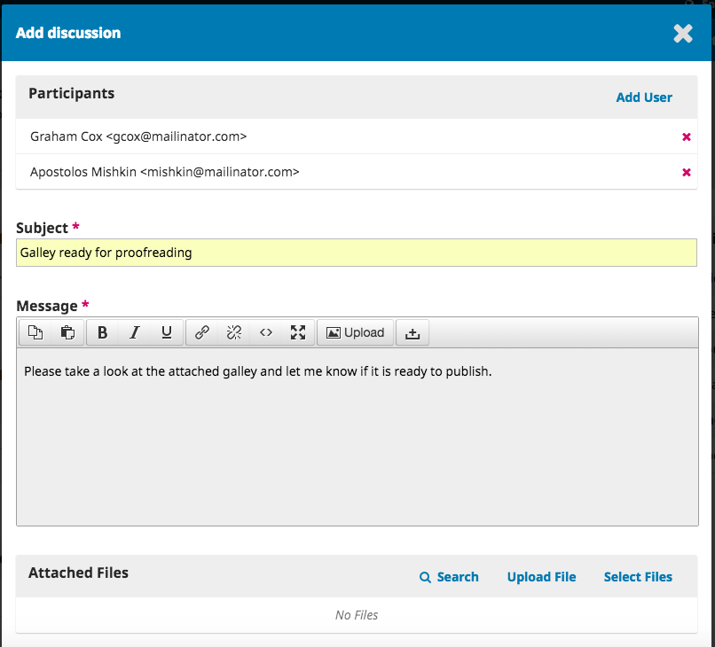

Lembre-se de adicionar o autor no início da janela, e depois inserir o assunto e mensagem.

Antes de enviar, porém, anexe a cópia do ficheiro PDF, clicando em Before sending, however, attach a copy of the PDF file using the _Upload Ficheiro_. Assim torna o ficheiro disponível para o autor visualizar.

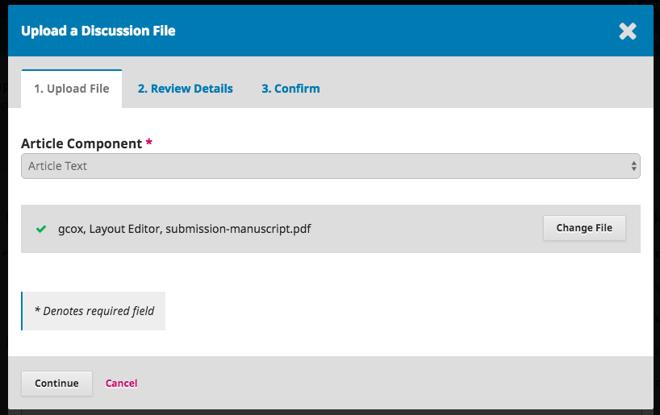

Lembre-se de selecionar o componente de Artigo correto, e depois transfira o PDF.

Clique em **Continuar**.

Em seguida, falta as alterações necessárias ao título do ficheiro \(geralmente não é necessário fazer alterações\).

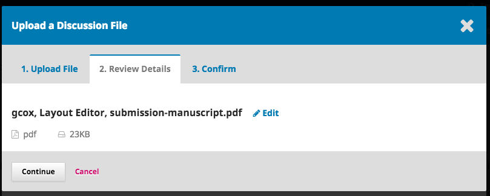

E então, pode transferir ficheiros adicionar, caso seja preciso.

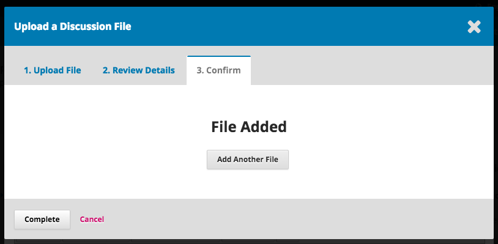

Quando terminar, clique em **Concluir**.

O ficheiro já se encontra anexado e pode enviar a mensagem usando o botão **OK**.

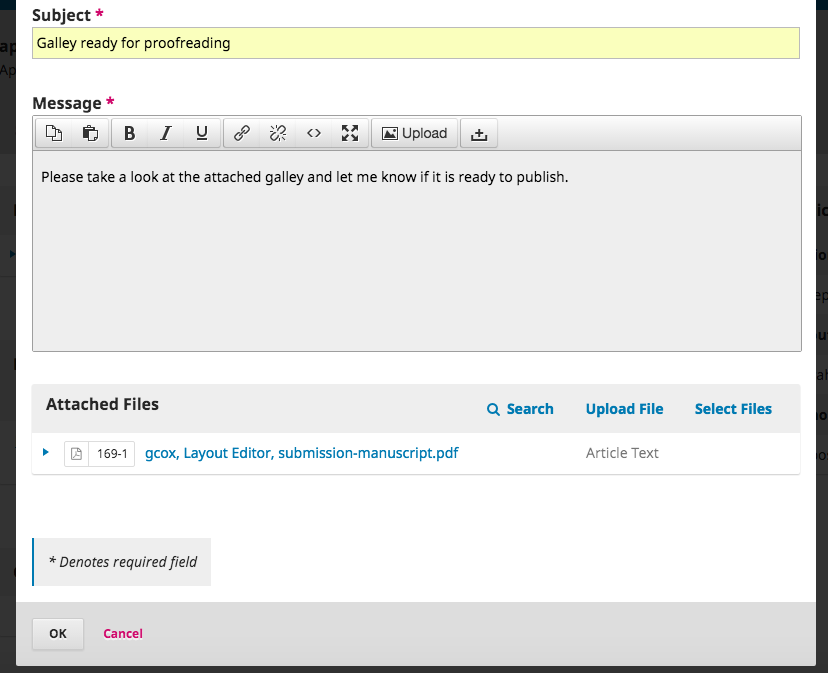

O Autor recebeu a notificação e agora pode aguardar a resposta.

## Resposta do Autor

Assim que o autor termine de rever as composições finais e responda, irá receber uma notificação por e-mail e verá a resposta nas Discussões da Produção.

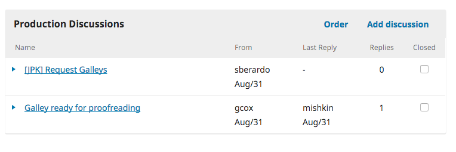

## Adicionar Composições Finais

Agora que o Autor já efetuou a revisão de provas, pode efetuar as alterações finais, e enviá-las para o painel para Publicação.

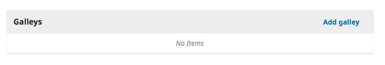

Para tal, clique em _Adicionar versão final_ , o que irá abrir uma nova janela.

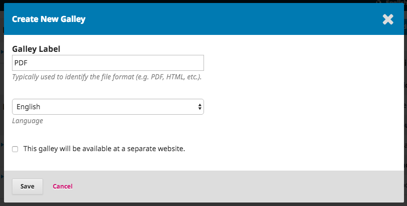

Insira o rótulo apropriado \(ex., PDF, HTML, etc.\) e clique em **Guardar**.

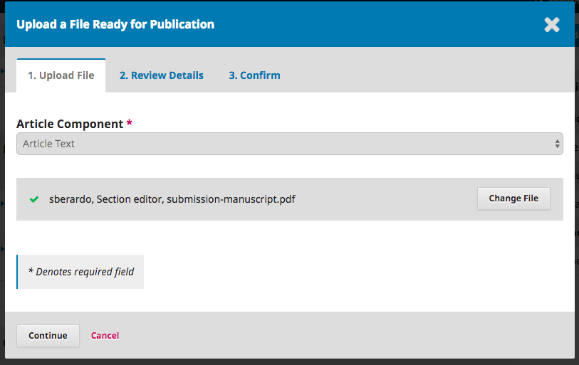

Nesta janela, escolha o componente do Artigo adequado \(ex., Texto Artigo\) e faça o upload da composição final. Clique em **Continuar**.

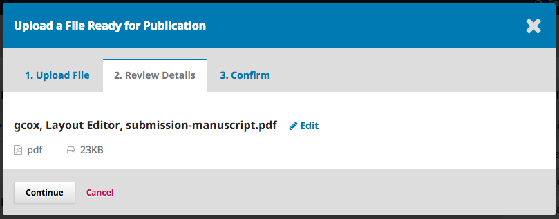

Se for necessário, altere o nome do ficheiro. Clique em **Continuar**.

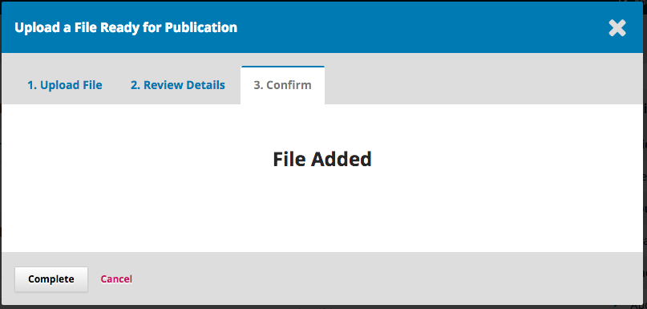

Se houver mais ficheiros para inserir, faça o upload deles agora. De outro modo, clique em **Concluir**.

Agora já pode ver as composições finais no painel Para Publicação.

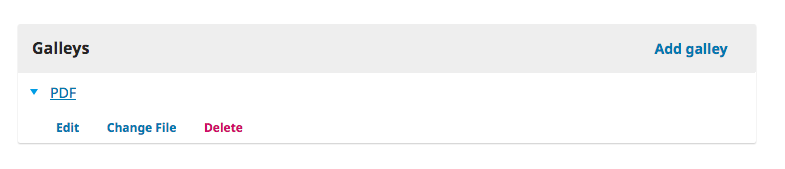

Pode efetuar alterações selecionando a seta azul à esquerda da composição final, o que irá revelar opções para editar, modificar o ficheiro, ou eliminar.

## Informar o Editor de Secção

Finalmente, é preciso informar o Editor de Secção que as composições finais estão concluídas. Para o informar, use o painel da Discussão de Produção e selecione _Adicionar Discussão_.

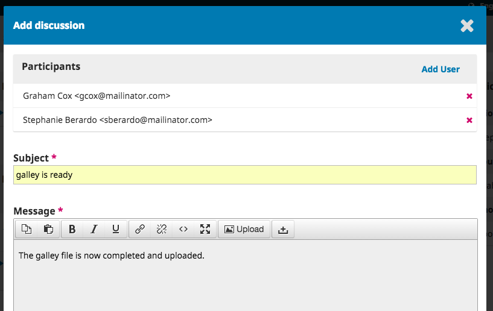

Adicione o Editor de Secção no início da página, e depois insira o assunto e a mensagem. Clique em **OK** para enviar a mensagem.

Agora já aparece a mensagem final no painel da Discussão.

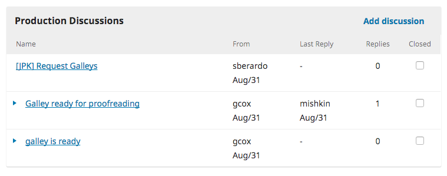

## Editor de Secção Informa o Editor

Neste ponto, o Editor de Secção recebe a notificação do Editor de Layout e revê as composições finais.

O Edito de Secção pode solicitar ao Editor de Layout alterações adicionais \(utilizando as Discussões da Produção\) ou informar o Editor que as composições finais estão prontas para publicação.

Para informar o Editor, use o painel de Discussões da Produção e clique em _Adicionar Discussão_.

## Agendar para Publicação

Assim que recebe a notificação relativamente à conclusão das composições finais, o editor autentica-se no sistema, entra no registo da submissão, e verifica os ficheiros de finais.

Se as composições finais parecem prontas para publicação, o editor clica no botão de ação azul  **Agendar para Publicação**.

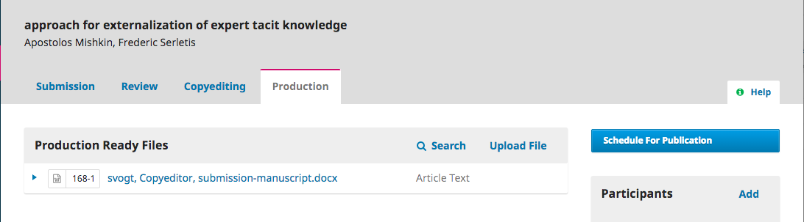

Ao selecionar este botão abre uma nova janela de Publicação.

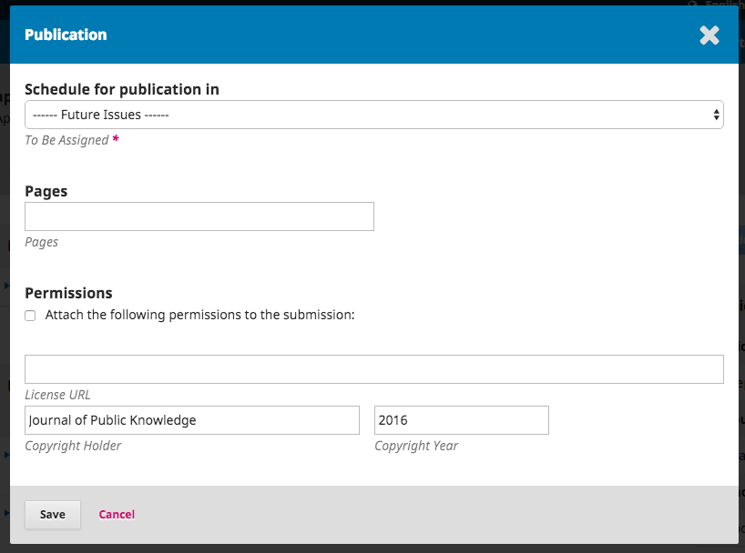

Use esta janela para adicionar a submissão a uma Edição anterior ou a uma Edição Futura da revista.

Também tem a opção de inserir os números das páginas, informações sobre as permissões e licenças.

Clicar no botão **Guardar** irá publicar a submissão da edição selecionada. Se a edição já estiver publicada, a submissão ficará imediatamente disponível aos leitores.

Parabéns! Chegou ao fim do processo editorial.

