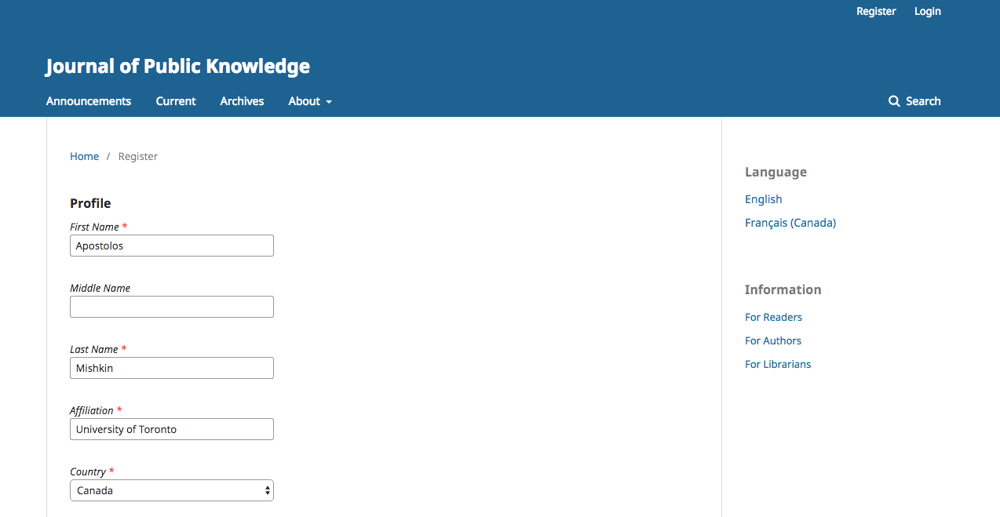

# Registar numa Revista

Visitantes sem registo normalmente podem registar-se como Leitor, Autor e/ou Revisor. Os Editores-gestores têm permissões para remover a possibilidade dos visitantes se registarem, e neste caso aparecerá uma notificação em como o registo se encontra momentaneamente encerrado (ver Configurações da Revista), mas os Editores-gestores podem sempre registar outros utilizadores a qualquer momento, e atribuir qualquer papel.

Para se registar numa revista, clique no link Registo no canto superior direito.

Irá abrir o Formulário de Registo para poder completar com a informação necessária.

Todos os campos com um asterisco (Nome, Apelido, Afiliação, País, E-mail, Nome de utilizador, Senha, Repetir Senha) são obrigatórios. Se a revista for multilingue, aparece a perguntar qual o seu idioma preferencial.

Ficará automaticamente registado como Leitor e Autor. Ser-lhe-á dada a opção de se registar também como Revisor.

O sistema não permite registar-se com permissões de Edição (ex., Editor, Editor de Secção, Editor de texto, Editor de Layout , Leitor de Prova, ou Editor-gestor). Se precisar de ter algum destes papéis, contacte um Editor-gestor ou o Administrador do sistema.

