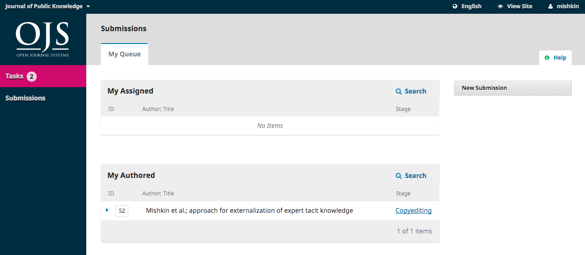

# Responder ao Pedido de Edição de Texto

O próximo passo no processo editorial é verificar os ficheiros da submissão que foram submetidos a revisão de texto. 

Irá receber um e-mail a indicar que os ficheiros estão disponíveis. Para os visualizar, autentique-se na revista e vá ao seu dashboard.

Pode visualizar a sua entrada no painel Minhas Autorias. Selecione o link Edição de texto para ir para o registo completo da submissão, incluindo a notificação no painel Discussões de Edição de texto.

Clique no título da discussão para a abrir, leia a mensagem, e abra o ficheiro em anexo.

Quando tiver terminado de ler o documento anexo, pode responder ao editor de texto indicando alterações requeridas ou a sua aprovação. 

Se for necessário, pode anexar uma revisão, mas para este exemplo vamos simplesmente aprovar as alterações e clicar em **OK**.

No seu dashboard, pode ver que foi a última pessoa a responder à mensagem.

O seu papel no processo de edição de texto encontra-se concluída e pode aguardar pelo pedido de leitura de provas das composições finais (ex., PDFs, HTML, etc.) antes da publicação.