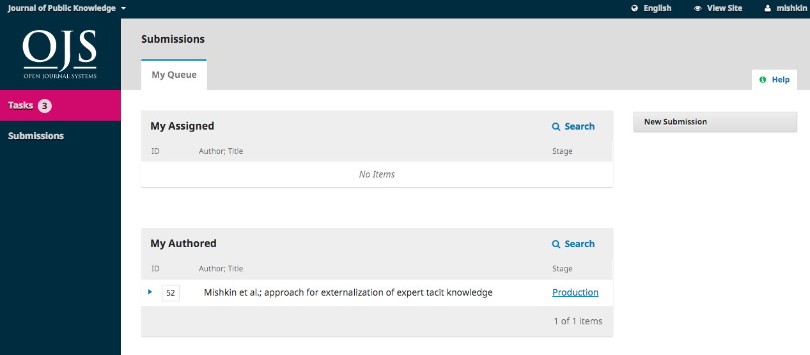

# Responder a solicitação de Revisão de provas

O próximo passo no processo editorial é avaliar os ficheiros da sua submissão que foram convertidos em composições finais (ex., PDF, HTML, etc.). 

Irá receber um e-mail a indicar que os os ficheiros estão disponíveis. Para os visualizar, autentique-se no sistema e vá ao seu dashboard.

Pode ver a sua entrada no painel Minhas Autorias. Selecione o link Produção para ser direcionado para o registo da submissão, incluindo a notificação no painel Discussões da Produção.

Clique no título da discussão para a abrir, leia a mensagem, e abra o ficheiro em anexo.

Quando terminar de ler o ficheiro anexo, pode responder ao Editor de Layout indicando quaisquer alterações que sejam necessárias ou a sua aprovação. 

Já está! O seu papel no processo editorial encontra-se terminada.