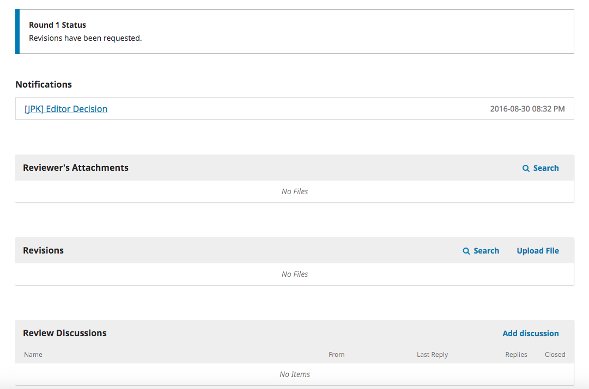
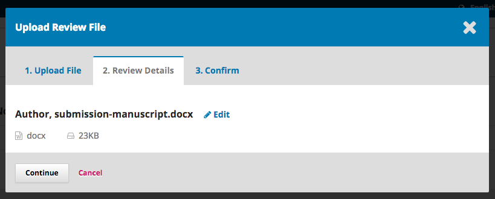
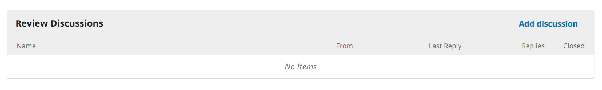

 # Responder a Revisão

Uma vez terminado o process de revisão, será notificado por e-mail pelo editor da decisão editorial.

Após receção do e-mail, autentique-se no seu dashboard.

Selecione o link *Revisão* à frente da sua submissão para visualizar a decisão.

Neste passo, pode ver a decisão emitida (revisões requeridas) e um link para a notificação do editor.

Com base na informação contida na mensagem do editor, deve preparar as suas revisões.

##Fazer Upload do Ficheiro revisto

Ao descer na página, encontra um painel para **Revisões**.

Use o botão *Upload Ficheiro* para enviar para o sistema o seu manuscrito revisto.

No menu , informe que está a enviar uma revisão de um ficheiro existente. 

Em seguida transfira um ficheiro revisto e clique em **Continuar**.

Verifique os detalhes do ficheiro e clique em **Continuar** de novo.

Se tiver mais ficheiros adicionar para transferir, faça-o agora. Se não tiver mais ficheiros, clique me **Concluir**.

O seu ficheiro revisto já se encontra visível no painel de Revisões.

##Informar o Editor

O seu próximo passo é informar o editor que o seu ficheiro revista já se encontra disponível. Para isso, vá ao painel de Discussões de Revisão.

Aí, selecione o link *Adicionar Discussão*.

Use o botão *Adicionar Utilizador* para adicionar o editor.

Insira o assunto e a mensagem.

Clique em **OK** para enviar a mensagem.

Foi enviado um e-mail ao editor e já consegue (bem como o editor) visualizar a mensagem no painel Discussões da Revisão.

Neste momento, o autor tem que aguardar que o editor lhe responda a informar que as revisões feitas estão conforme se esperava.

##Revisões Aceites

Irá receber um e-mail a informar que as suas revisões foram aceites.

Além do e-mail que receber, as notificações aparecerão no seu dashboard.

A última notificação é a atual. Clique nela para abrir a mensagem (que será igual à mensagem que recebeu por e-mail).

Use o **X** no canto superior direito para fechar a janela.

Mais abaixo no seu dashboard, também ver a resposta à discussão pelo editor.

Ao clicar no título da discussão irá abri-la.

Parabéns! A sua submissão foi aceite e o seu ficheiro da submissão irá seguir para a etapa de Edição de texto.