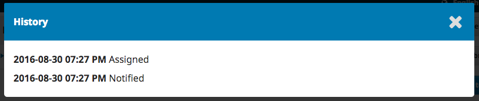
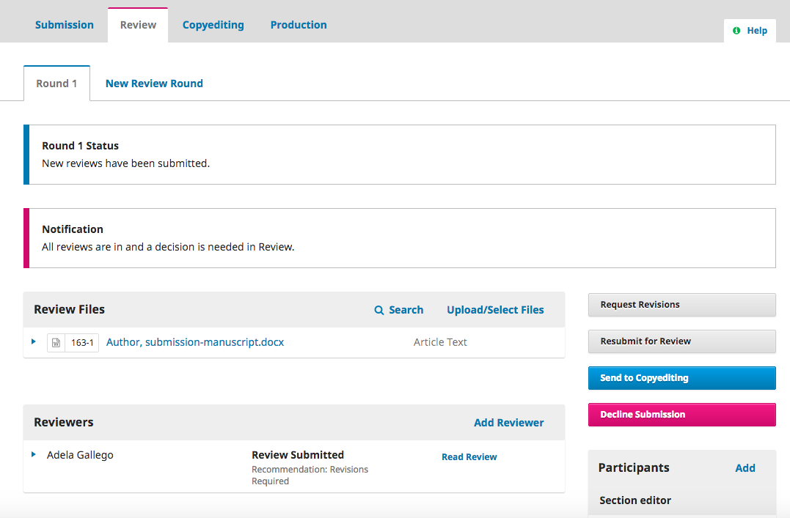
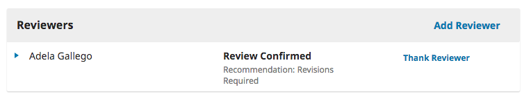
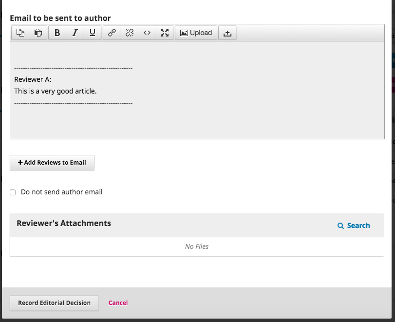

# Revisão

Quando a submissão entra na etapa de Revisão, uma notificação indica que é necessário designar os Revisores.

> Nota: No print screen acima,, estamos a ver o dashboard do Editor de Secção. Repare nos botões de Ação limitados \(apenas Emitir Recomendação está disponível\). Se nos autenticarmos como Editor, teremos acesso a mais botões de Ação \(Revisões Requeridas, Enviar novamente para Revisão, Enviar para Edição de Texto, Rejeitar  Submissão\).

No painel dos Revisores, clique em Adicionar Revisor para designar um novo Revisor.

Isto abre uma nova janela, onde se encontra uma lista dos Revisores que podem ser selecionado um de cada vez.

Note os detalhes visíveis sobre os Revisores, incluindo as suas áreas de interesse, designações anteriores, etc.

Nas versões 3.0 e 3.1.0 do OJS, não pode designar um revisor se ele também for editor da submisão. Se o fizer, o editor perde a possibilidade de aceder à submissão depois de submeter a revisão, de forma a manter os princípios da revisão cega. No entanto, a partir da versão do 3.1.1 do OJS, já pode designar um utilizador para rever uma submissão mesmo que este seja também editor dessa submissão.

No final deste formulário, terá as seguintes opções:

**Selecionar Revisor**: Use isto para confirmar a sua seleção assim que tiver clicado num Revisor da lista.

**Criar Novo Revisor**: Se nenhum dos Revisores for adequado, pode usar este botão para criar um novo Revisor, criando uma nova conta no sistema.

**Inscrever Utilizador Existente**: Se nenhum dos Revisores for adequado, pode atribuir o papel de Revisor a um utilizador existente no sistema.

Para demonstração, vamos escolher Adela como Revisora e clicar no botão **Selecionar Revisor**.

Esta ação abre uma nova janela com uma mensagem para enviar para o Revisor.

Pode rever o texto da mensagem padrão.

Se a sua revista tem por definição a Revisão Cega, assegure-se que os ficheiros não contém qualquer informação identificativa sobre o Autor.

Mais abaixo no formulário, poderá ver os detalhes adicionais que são enviados para o Revisor tal como título, resumo, datas importantes, e o link para os ficheiros que serão revistos.

Por padrão, os Revisores terão uma caixa de texto para inserir os seus comentários. No entanto, o Editor-gestor pode criar Formulários de Revisão nas [**Configurações de Fluxo de Trabalho &gt; Revisão**](https://pkp.gitbooks.io/ojs3/content/en/workflow_settings.html) para perguntar questões mais focadas. Se pretender que o Revisor preencha o formulário de revisão, escolha o que adequado em **Formulário de Revisão**.

Clique em **Adicionar Revisor** para enviar a mensagem e designar o Revisor.

De volta à etapa de Revisão, já podemos ver que o nome do Revisor se encontra na lista.

Pode efetuar alterações adicionais através da seta azul presente do lado esquerdo do nome do Revisor.

**Detalhes Revisão**: Fornece detalhes sobre a revisão.

**E-mail ao Revisor**: Permite-lhe enviar uma mensagem ao Revisor.

**Editar**: Permite-lhe alterar as datas de revisão e ficheiros.

**Desassociar Revisor**: Permite-lhe desassociar o Revisor.

**Histórico**: Fornece um breve histórico da revisão.

Neste ponto, podemos adicionar Revisores adicionais, e depois aguardar que enviem as suas recomendações.

## Responder às Revisões

Quando os Revisores terminarem o seu trabalho, o Editor de Secção pode ser os resultados no seu dashboard. Aqui irão ver as notificações a informar que foram submetidas novas revisões e se já foram enviadas todas as revisões.

Use o link _Ler Revisão_ no painel dos Revisores para ler os comentários que os Revisores fizeram, tanto os comentários da caixa de texto tanto para Autores como Editores como os comentários apenas para Editores.

Selecione o link _Confirmar_ no fundo da página.

No painel dos Revisores, tem ainda um botão de  _Agradecer ao Revisor_. Clique aqui para enviar uma mensagem de agradecimento ao Revisor.

Clique em **Agradecer ao Revisor** para enviar a mensagem.

## Emitir Decisão

Com base nas recomendações do Revisor, use os botões de ação para emitir a decisão editorial.

Existem as seguintes opções:

**Requerer Revisões**: Esta decisão solicita ao Autor para efetuar pequenas alterações, mas não será necessário nova ronda de revisão.

**Enviar novamente para Revisão**: Esta decisão requer que o Autor faça bastantes alterações e quando enviar o ficheiro revisto, uma nova ronda de revisão será iniciada.

**Enviar para Edição de Texto**: Esta decisão significa que a submissão é aceite sem revisões e pode proceder para a etapa de Edição de texto.

**Rejeitar Submissão**: Esta decisão significa que a submissão não passou na revisão por pares e não é adequada para publicação. A submissão seguirá para os Arquivos.

## Revisões Requeridas

Nesta demonstração, vamos solicitar ao Autor que faça pequenas alterações antes de aceitar a submissão.

Para isso, selecione o botão **Revisions Requeridas**. Esta ação irá abrir uma nova janela.

Pode alterar o texto da mensagem antes de a enviar.

Use o botão **Enviar Revisões por E-mail** para importar os comentários do Revisor da caixa de texto destinada ao Editor e ao Autor. Os comentários da caixa de texto apenas para o Editor não serão apresentados.

Se houver anexos, tal como ficheiros com comentários do Revisor, pode anexá-lo aqui \(desde que o ficheiro esteja anonimizado\).

Clique em **Registar Decisão Editorial** para enviar a mensagem.

Agora terá de aguardar que o Autor responda com as suas revisões.

## Autor Responde

Assim que o Autor envie as suas revisões, deverá receber uma mensagem \(via e-mail e no painel de Discussões da Revisão\).

Também pode ver o ficheiro revisto no painel das Revisões.

Aqui pode transferir para o seu computador o ficheiro revisto, verificar se está pronto, e comunicar com o Autor através do painel Discussões de Revisão.

Neste caso, vamos informar o Autor que vamos aceitar as revisões. Para isso, clique no título da discussão. Isto irá abrir uma caixa de discussão.

![!\[\]\(learning-ojs-3-ed-discussion-window.png\)](learning-ojs-3-ed-discussion-window.png)

Clique em **Adicionar Mensagem** para responder.

Outra opção seria solicitar revisões adicionais, mas neste ponto estamos prontos para seguir para a etapa seguinte.

## Seguir para Edição de Texto

A submissão encontra-se agora pronta para seguir para edição de texto. Para efetuar esta ação, use o botão azul **Enviar para Edição de texto**.

Isto irá abrir uma nova janela.

Clique em **Registar Decisão Editorial**no fundo da página.

A submissão segue automaticamente para a etapa de Edição de Texto.

