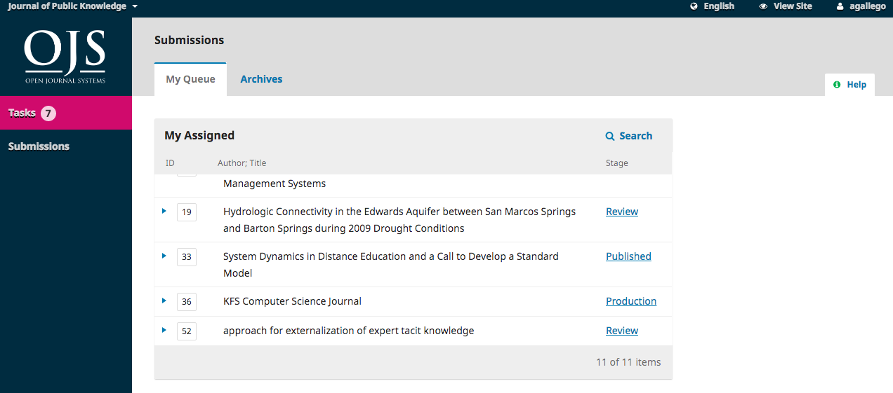
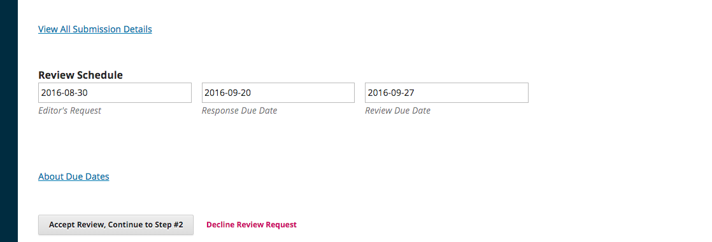

# Capítulo 12: Revisão

Como revisor, receberá um e-mail com pedido de revisão ou através do seu dashboard:

Na lista Meus Designados, encontre o título e o link de Revisão. Repare na falta de qualquer informação de autor neste processo de revisão duplamente cega.

Ao selecionar o link Revisão irá direcioná-lo para o primeiro passo de revisão no registo da submissão, que é consideravelmente mais limitado do que a vista de editor, e não contém informações sobre o autor.

O primeiro passo consiste nas seguintes secções:

**Pedido de Revisão**: fornece algumas informações que o convidam a agir como revisor.

**Título do Trabalho**: fornece o título do artigo.

**Resumo**: fornece o resumo do artigo.

Mais abaixo no ecrã, encontra informação adicional.

O link **Ver Detalhes do Trabalho** irá abrir uma nova janela com informação adicional, incluindo todos os metadados exceto os do autor:

Repare que nenhum destes campos são editáveis pelo revisor, e são apenas apresentados para o ajudar a conduzir uma revisão minuciosa.

Feche esta janela e desca na página para visualizar o Cronograma de Revisão, incluindo todas as datas e prazos relevantes.

Nesta página, pode aceitar ou recusar a revisão. Se rejeitar, será retirado do processo. Se aceitar, poderá seguir para o passo 2, onde se encontram as diretrizes de revisão fornecidas pela revista.

Clique em **Continuar** para seguir para o passo 3. Neste passo, pode transferir uma cópia dos ficheiros a rever e inserir os seus comentários. A primeira caixa de texto é para comentários para o autor e editor; a segunda caixa de texto destina-se apenas ao editor.

Quando tiver terminado de ler o artigo e adicionar os seus comentários, desça na página e se pretender insira um ficheiro com os seus comentários \(lembre-se de eliminar qualquer informação pessoal do ficheiro antes de o enviar para o sistema\).

Em seguida, deve inserir a sua recomendação escolhendo uma das opções existentes no menu.

As suas opções são:

**Aceitar**: o artigo encontra-se pronto para a etapa de edição de texto.

**Correções obrigatórias**: o artigo requer pequenas alterações que podem ser revistas e aceites pelo editor.

**Submeter novamente para Revisão**: o artigo necessita de alterações profundas e deverá ser reenviado para nova ronda de revisão.

**Enviar a outra Revista**: o artigo não parece ser adequado ao âmbito da revista.

**Rejeitar**: o artigo tem demasiadas fraquezas para ser aceite.

**Ver Comentários**: se nenhuma das recomendações anteriores for apropriada, pode deixar um comentário para o editor detalhando as suas preocupações.

Por fim, clique em Submeter Revisão para completar a tarefa e confirme a sua ação.

Clique em OK. Será reencaminhado para o página final de agradecimento pela sua contribuição.

Já está! A revisão encontra-se concluída.

