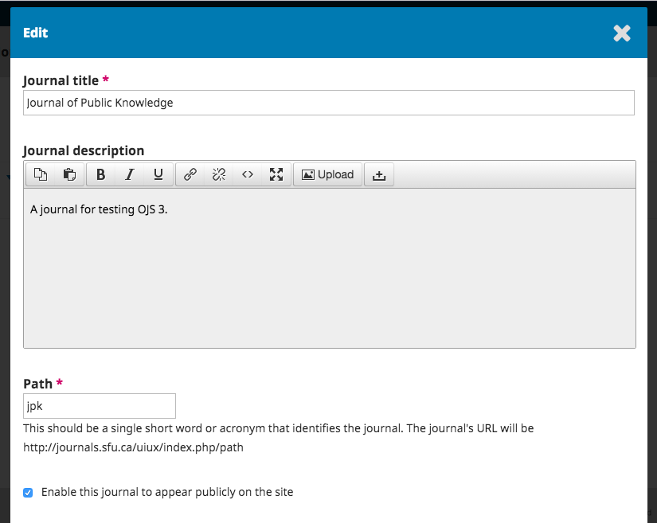
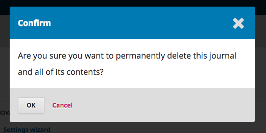
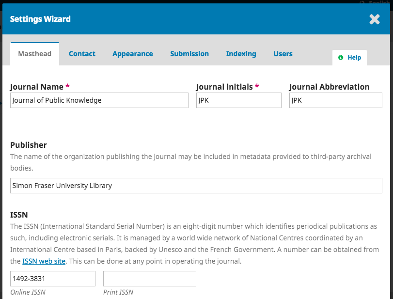
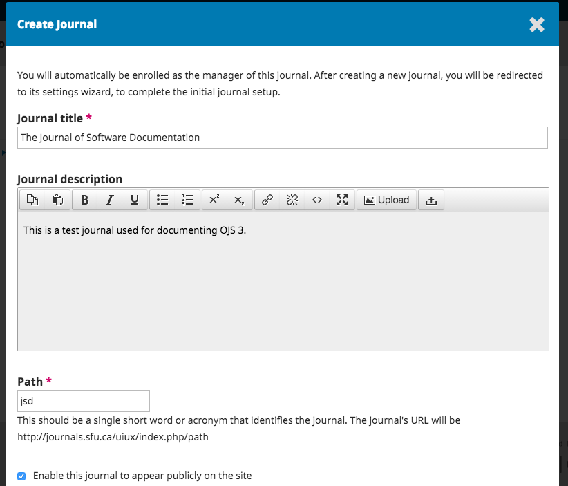

# Administração do Portal

Para aceder à Administração do Portal, autentique-se no sistema como Administrador do Portal, e selecione Administração no menu lateral à esquerda.

## Revistas Hospedadas

Na Administração do Portal, selecione Revistas Hospedadas. Na página aberta, aparecerá uma lista com todas as revistas existentes na instalação do OJS. No exemplo abaixo, só existe uma revista.

Para editar uma revista existente, clique na seta azul à esquerda do título da revista. Verá opções para editar, remover, ou atualizar as configurações.

**Editar** irá abrir uma janela para alterar o título, descrição, ou caminho.

**Remover** irá eliminar a revista da instalação. Ser-lhe-á solicitado que confirme se deseja realmente efetuar esta ação, uma vez que é irreversível.

**Assistente de Configurações** irá abrir várias opções de configurações para aquela revista. Veremos estas configurações com mais detalhe no Capítulo 5.

**Utilizadores **permite-lhe adicionar ou gerir os utilizadores associados à revista.

De volta às Revistas Hospedadas, pode usar o botão Criar Revista para adicionar uma nova revista a esta instalação do OJS. No formulário de nova revista, preencha os campos com a informação sobre a nova revista a criar.

> Nota: Se não pretender que a revista fique já visível, retire a seleção de  _Permitir que esta revista fique pública no Website _ .

## Configuração do Portal

Esta secção só aparece a instalações com duas ou mais revistas, e permite-lhe adicionar informação relativa à instalação geral do OJS, não a revistas individuais.

### Configuração do Website

Esta secção serve para inserir o nome do site, o logotipo do site, uma descrição introdutória sobre o site, o rodapé, uma opção de redirecionamento \(se planear ter apenas uma revista na sua instalação\), informação de contacto, o tamanho mínimo de senha para o registo de utilizadores, e gestão da barra lateral.

Terá oportunidade de inserir informações sobre a(s) sua(s) revista\(s\) mais tarde.

### Idiomas

O OJS é um sistema multilingue e aqui pode adicionar idiomas adicionais para serem utilizadas no seu site, tornando-as disponíveis para todas as revistas da sua instalação.

O OJS 3.1 ainda não tem tantas traduções como o OJS 2, mas aguardamos mais contribuições com o tempo. As contribuições da comunidade são sempre bem-vindas.

### Plugins

Nesta secção, pode escolher ativar ou desativar vários plugins, tornando-os disponíveis \(ou não\) para todas as revistas da sua instalação do OJS.

### Menus de Navegação

Use esta secção para modificar os seus menus visíveis no site. Pode ler mais sobre configuração de menus no Capítulo 5.

## Próximos Passos

Assim que a revista estiver criada e inseridas as configurações do site, deverá criar uma conta de utilizador para o Editor-gestor ou o Editor -- ver [Capítulo 7](/users_and_roles.md "Chapter 7: Users and Roles") para mais detalhes.

