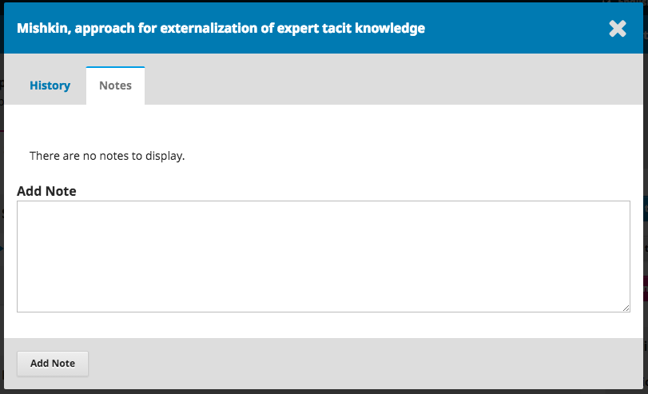
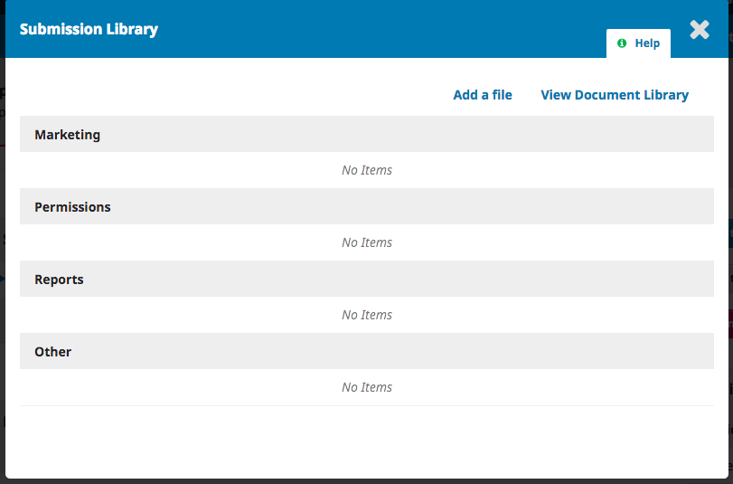
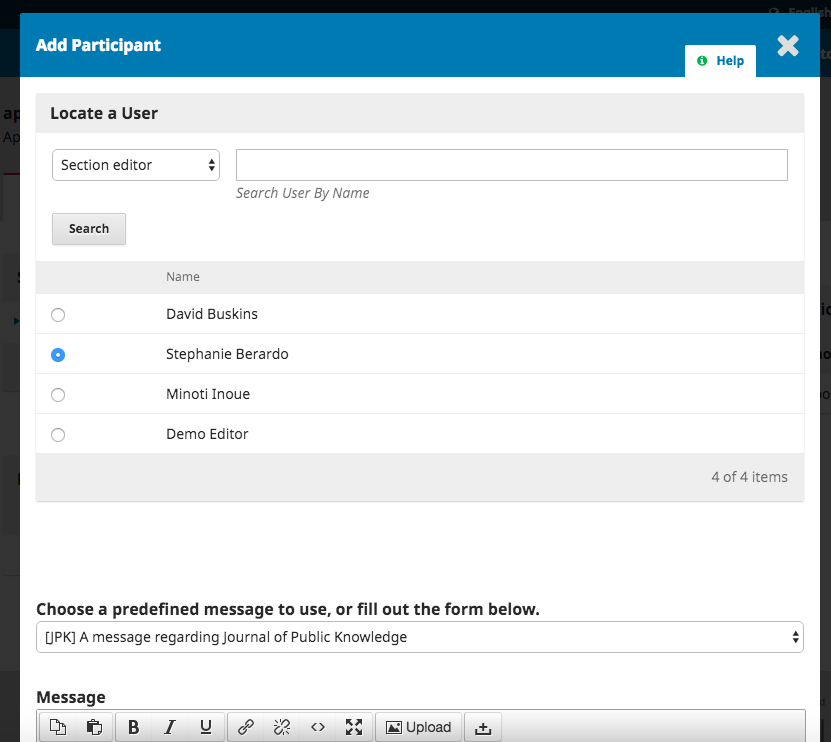

# Submissões

Quando um autor envia uma submissão para a revista, o editor recebe um e-mail automático. Quando se autentica no sistema e entra no seu Dashboard, pode encontrar a submissão através das suas Tarefas, ou através de uma das suas filas\(Minha Fila, Não Designado, Ativos, e Arquivos\).

## Minha Fila

**Minhas Designações**: Este painel inclui submissões que foram enviadas para secções em que tenha o papel de Editor de Secção ou as suas próprias submissões se também tiver o papel de autor na revista.

A ferramenta **Pesquisar** para cada fila pode por vezes ser útil para encontrar submissões.

A ferramenta **Filtros ** permite-lhe limitar a sua pesquisar a estados específicos, \(ex., incompleto, atrasado\), etapas \(submissão, revisão, edição de texto, produção\), ou secções \(ex., artigos, recensões\) para uma pesquisa mais rápida.

Note que pode usar as setas azuis à direita de cada submissão para revelar mais detalhes, incluindo quantas revisões estão pendentes, novas discussões, e muito mais. Também releva botões para o redirecionar para o registo da submissão, ver o histórico de atividades e notas, e para eliminar a submissão.

## Não Designado

Este painel reúne as submissões enviadas para secções sem editores de secção atribuídos.

No exemplo acima, não existem submissões não designadas, portanto o painel encontra-se vazio.

## Ativos

Nesta secção encontra-se a lista de todas as submissões, sem estarem organizadas por filas.

## Arquivos

Esta secção tem uma lista de todas as submissões ou rejeitadas ou publicadas na revista.

## Demonstração de Submissão

Para esta demonstração, estamos à procura da submissão de Williamson e Serletis, com o título _The Official Knowledge and Adult Education Agents_. Pode ser encontrado no topo da fila **Minhas Designações**

Quando encontrar a submissão, pode usar a seta azul para revelar opções para ver se há alguma discussão aberta \(não há nenhuma\), bem como para visualizar a submissão, ver o histórico de atividade e notas, ou para eliminar a submissão.

**Eliminar** envia a submissão para os Arquivos e **Histórico de Atividade e Notas** abre o histórico da submissão.

## Registo da Submissão 

Para ver a submissão com mais detalhe, clique em **Visualizar Submissão**. Este botão irá direcioná-lo para o registo da submissão.

No registo da submissão, pode ver:

**Ficheiros da Submissão**: Neste painel podemos visualizar os ficheiros submetidos. Neste exemplo, temos apenas um ficheiro, mas podem ser submetidos vários ficheiros.

**Discussões Pré-Revisão**: Este painel permite ao editor comunicar com o autor, ou com outras pessoas da equipa editorial. Por exemplo, para pedir ao autor informações adicionais, ou para solicitar a um editor de secção para assumir a gestão desta submissão.

**Botões de Ação**: Os botões de ação são Enviar para Revisão, Aceitar e Saltar Revisão, e Rejeitar Submissão.

> Nota: Se não conseguir ver estes botões, a razão mais provável é ainda não ter designado a submissão a um editor.

**Participantes**: Neste painel vemos a lista de pessoas que estão envolvidas na submissão, incluindo o editor, editores de secção, e autor. Outros nomes \(editores de texto, editores de layout, etc.\) aparecerão nesta lista conforme forem sendo adicionados nas etapas seguintes.

Além destes botões, na barra azul no topo da página, pode ver:

**Metadados**: Onde pode ver e rever os metadados da submissão.

Use a secção dos Identificadores para ver ou adicionar um identificador único.

**Histórico Editorial**: Onde pode ver o histórico e quaisquer notas sobre a submissão.

Use as Notas para ver ou adicionar notas editoriais.

**Biblioteca da Submissão**: Onde pode adicionar os documentos relevantes para a Biblioteca da Submissão.

## Designar um Editor à Submissão

Dependendo de como configurou as secções, algumas novas submissões podem entrar como Não designado. Nestes casos, o próximo passo é designar a submissão a um editor ou editor de secção. Para efetuar esta ação, clique em _Designar_ no painel dos **Participantes**.

Aparecer-lhe-á a opção de localizar um utilizador por papel, escolha um editor, e envie uma mensagem a solicitar a sua intervenção.

> Nota: Se não souber os nomes dos editores de secção, simplesmente escolha esse papel no menu dos papéis e clique em Pesquisar. Aparecerá uma lista com os nomes de todos os Editores de Secção disponíveis para seleção.

Clique em **OK** para atribuir a submissão e enviar a mensagem.

> Note que uma nova Discussão Pré-Revisão foi automaticamente criada como parte da designação.

Agora já pode ver que o Editor de Secção se encontra na lista dos Participantes, e os Botões de Ação estão disponíveis:

**Enviar para Revisão**: Envia a submissão para a etapa seguinte.

**Aceitar e Saltar Revisão**: Salta a etapa de Revisão e envia a submissão diretamente para a Edição de Texto.

**Rejeitar Submissão**: Rejeita a submissão antes de seguir para o processo de revisão. A submissão irá ser arquivada.

Apesar de neste exemplo, o editor ter designado um editor de secção, também é possível ao editor designar-se a si próprio para a submissão.

## Editor de Secção

Agora que o Editor de Secção foi designado, já pode autenticar-se e ver a submissão no seu dashboard. A submissão encontra-se no início da fila Minhas Designações.

Ao clicar no título do artigo, abre o registo completo da submissão.

### Aceitar a Designação

Não é obrigatório, mas o Editor de Secção pode responder à Discussão Pré-Revisão a informar o editor que aceita a designação à submissão.

### Comunicar com o Autor

Se o Editor de Secção tiver perguntas para colocar ao autor, pode usar as Discussões Pré-Revisão.

### Enviar para Revisão

Quando o Editor de Secção considerar que a submissão é apropriada para a revista, pode clicar no botão **Enviar para Revisão** para que a submissão siga para a etapa seguinte.

Mantenha os ficheiros que são para enviar para revisão selecionados.

