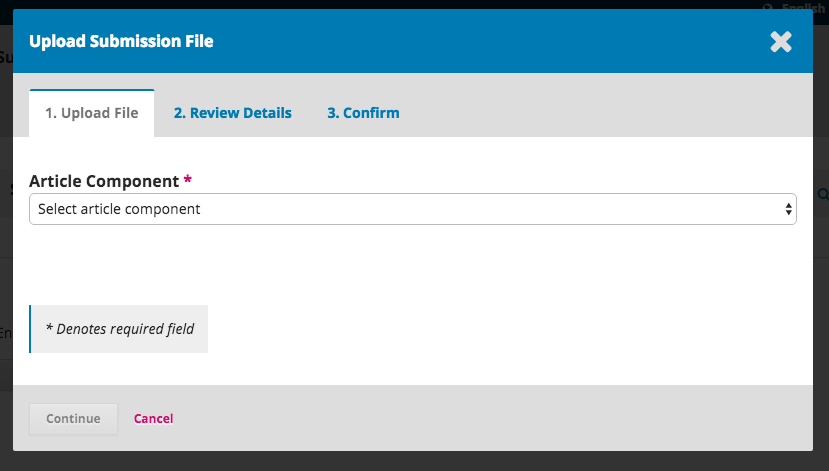
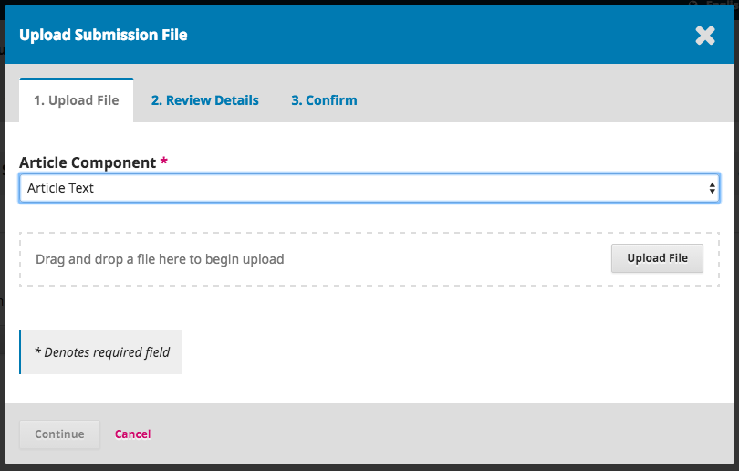
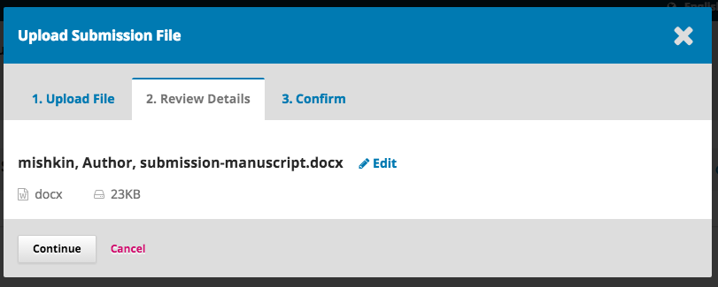

# Submeter um Artigo

Inicie uma nova submissão ao clicar em **Nova Submissão** no lado direito do ecrã. Será direcionado para o Passo 1 de um processo de 5-Passos para efetuar o upload e descrever a sua submissão.

## Passo 1

No **Passo 1** irá inserir informação preliminar sobre a sua submissão.

Para começar selecione a secção adequada para a sua submissão \(ex., artigos, recensões, etc.\). Se não tiver a certeza qual a secção mais adequada, selecione a que considera mais pertinente.

Leia e aceite os requisitos de submissão selecionando todos os ítens de verificação. Inclua os comentários que pretender ao editor, leia a declaração de privacidade, e depois clique em **Guardar e continuar** para seguir para o **Passo 2**.

## Passo 2

No **Passo 2**, abrirá uma janela que lhe permitirá fazer o upload do ficheiro de submissão.

Em primeiro, DEVE selecionar o Componente do Artigo. Esta informação permite ao sistema saber se o ficheiro é o corpo de texto do manuscrito, uma imagem, um conjunto de dados, etc. **Esta seleção deve ser feita antes de enviar o ficheiro**.

Quando efetuar esta seleção, pode em seguida enviar o primeiro ficheiro. É importante notar que pode apenas enviar **um** ficheiro de cada vez. Ficheiros adicionais podem ser enviados em seguida. Geralmente, o primeiro ficheiro é o corpo do artigo. Clique em **Continuar** no final de fazer upload do ficheiro.

No final de enviar o ficheiro, o sistema pergunta se pretende rever o título do ficheiro. Use o link Editar para efetuar quaisquer alterações.

Clique em**Continuar**.

De sgeuida, tem a opção de repetir o processo para inserir ficheiros adicionais \(ex., um conjunto de dados ou uma imagem\).

Quando terminar de inserir todos os ficheiros, clique em **Concluir**; a janela de transferência de ficheiros irá fechar.

You will be brought back to the _Submit an Article_ screen where you will see the files you’ve uploaded. If you need to make changes, expand the blue arrow to the left of your file and make any changes using the _Edit_ link.

Clique em ‘Guardar e Continuar’ para seguir para o Passo 3.

## Passo 3

No **Passo 3**, ser-lhe-á solicitada mais informação sobre a submissão, tal como o título da submissão \(dividido em prefixo, título, e subtítulo\), o resumo, e andando para baixo...

...os colaboradores adicionais.

Pode adicionar mais colaboradores \(ex., coautores\), clicando em **Adicionar Colaborador**. Esta ação irá abrir uma nova janela com campos para inserir a informação do(s) colaborador(es).

Clique em **Guardar**, e o novo colaborador aparecerá no ecrã.

Dependendo das políticas da revista a que está a submeter um artigo, pode ter campos adicionais para preencher, tais como palavras-chave.

Para inserir uma palavra-chave, simplesmente insira a palavra ou frase e carrega na tecla Enter do seu teclado. A palavra ou frase ficará automaticamente formatada como palavra-chave.

Clique em **Guardar e Continuar** para seguir em frente.

## Passo 4

No Passo 4, o sistema pergunta-lhe se pretende rever a sua submissão ou concluir o envio.

Clique em **Concluir Submissão**.

Aparece uma janela no seu ecrã pedindo-lhe que confirme que deseja realmente concluir a submissão. Clique em **OK**.

## Passo 5

A sua submissão está concluída! O editor foi notificado da sua submissão. Neste ponto, pode seguir os seguintes links:

* Rever esta submissão
* Criar uma nova submissão
* Voltar à Área Pessoal

Quando terminar a submissão, já não poderá efetuar alterações. Se pretender substituir o ficheiro submetido ou efetuar outras alterações, terá de contactar o editor através da ferramenta Discussões Pré-Revisão. 

## Dashboard

Quando termina a submissão, esta aparecerá no seu Dashboard. Pode verificar que se encontra atualmente na etapa de _Submissão_.

Nos próximos dias, irá seguir para a etapa de Revisão, e se for aceite para a etapa de Edição de Texto e Produção antes de ser publicado.

