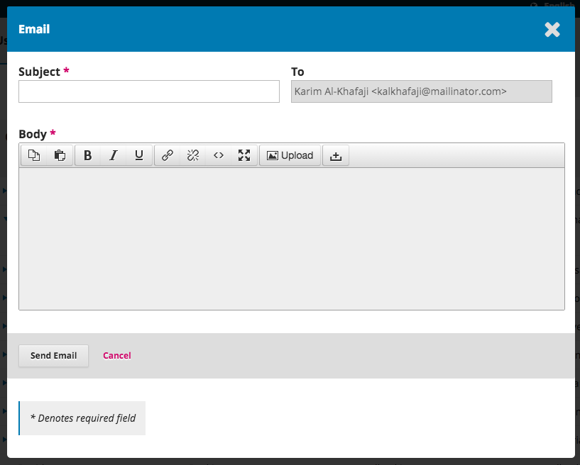
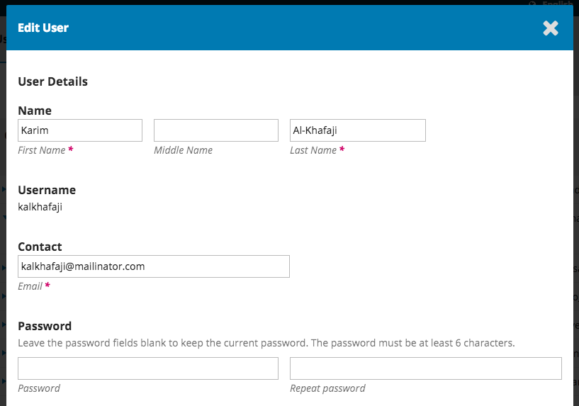
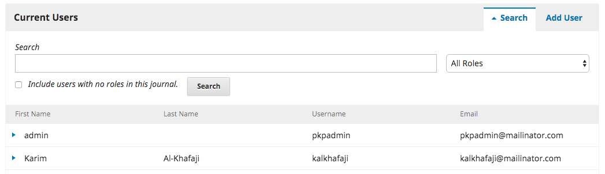
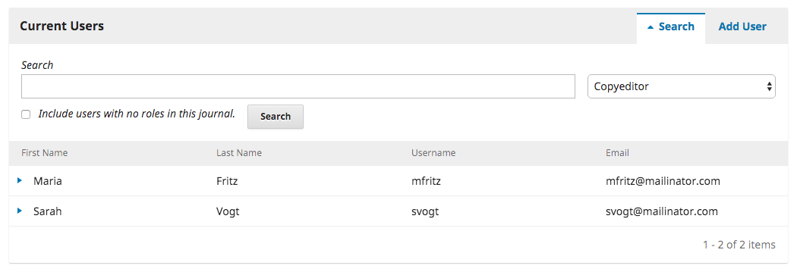
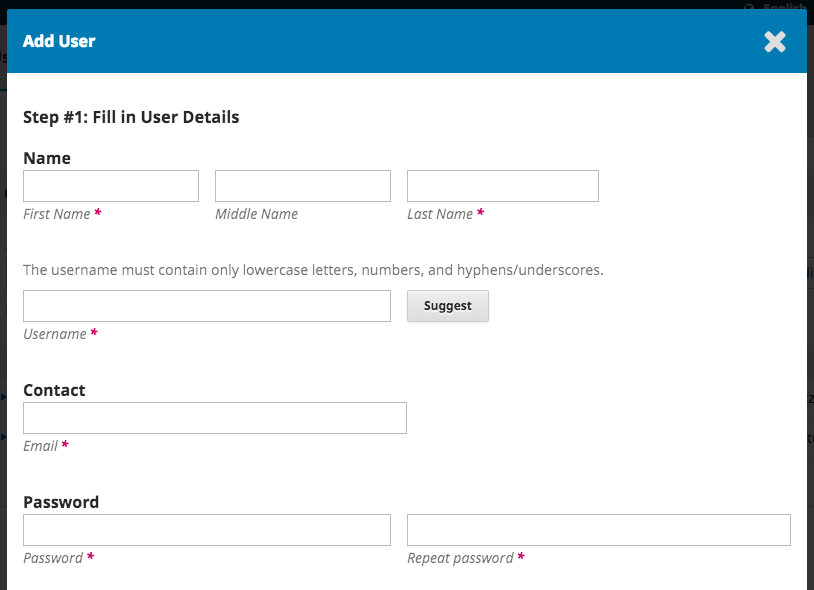
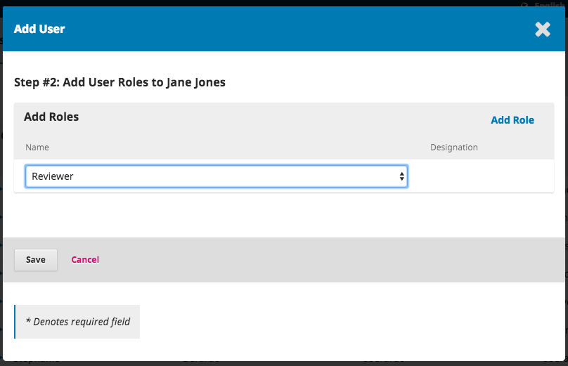

# Utilizadores

Além de gerir o website da revista, o Editor-gestor também é responsável por todas as contas de utilizadores no sistema.

Para visualizar as contas de utilizador, selecione Utilizadores & Papéis a partir do menu lateral à esquerda.

## Utilizadores

Os Utilizadores encontram-se listados por ordem do apelido.

Pode editar uma conta de utilizador selecionando a seta azul à esquerda de uma entrada.

Ao clicar na seta, abre as opções E-mail, Editar Utilizador, Desativar, Remover, Entrar como, Juntar Registo.

**E-mail** abre uma janela que lhe permite rapidamente enviar uma mensagem a esse utilizador.

**Editar Utilizador** permite-lhe efetuar alterações a essa conta de utilizador.

**Desativar** mantém a conta no lugar, mas bloqueia o utilizador de aceder ao sistema.

**Remover** elimina a conta de utilizador dos seus registos da revista e o utilizador deixa de poder autenticar-se, mas a conta mantém-se no sistema.

**Entrar como** permite-lhe temporariamente autenticar-se como aquele utilizador, por exemplo, para completar uma tarefa pendente.

**Juntar Registo** permite-lhe juntar esta conta de utilizador, incluindo quaisquer submissões ou designações, com outra conta de utilizador existente no seu sistema.

> **Nota**: Esta é a única forma de remover completamente uma conta no sistema.

Poderá criar uma conta de utilizador fictícia \(ex., Utilizadores Eliminados\), e usá-la para juntar os registos de contas indesejadas.

### Pesquisar

Quando tem um grande número de utilizadores, a ferramenta Pesquisar ajudá-lo-á a encontrar o utilizador que pretende.

Esta ferramenta ajuda-o a encontrar utilizador através do primeiro nome, apelido, ou endereço de e-mail, ou a ver todos os utilizadores associados a um papel específico.

**Nota**: Se deixar o campo Pesquisar, selecionar o Papel, e clicar em Pesquisar,  terá a lista de todos os utilizadores com esse papel \(ex., todos os editores de texto\).

### Adicionar Utilizador

Para adicionar um novo utilizador à sua revista, selecione o link Adicionar Utilizador. Abrirá uma nova janela com vários campos para preencher.

Assim que terminar de preencher os campos e clicar em  _Guardar_, ser-lhe-á pedido que adicione papéis à nova conta. Use o link _Adicionar Papel_ para abrir o menu de seleção de papéis.

Quando tiver adicionado todos os papéis, clique em **Guardar**.

