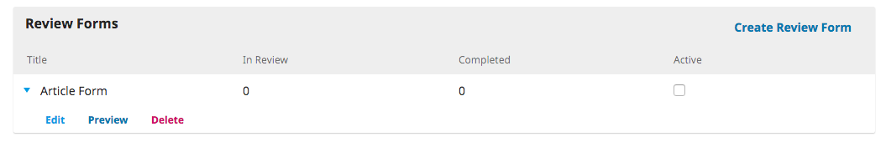

# Configurações do Fluxo de trabalho

As Configurações do Fluxo de trabalho permitem a configurar o processo editorial da revista. As abas  incluem Componentes, Submissão, Revisão, Biblioteca da Editora, e E-mails.

## Componentes

Quando autor envia uma submissão, pode transferir vários ficheiros. Geralmente, um ficheiro será o artigo, e os outros podem incluir transcrições de entrevistas, dados, imagens, etc. Cada um destes ficheiros é um **componente** da submissão. Os componentes disponíveis ao autor encontram-se nesta lista.

Ao utilizar os links fornecidos, é possível alterar a **Ordem** dos componentes \(ordem em que aparecerá ao autor durante a submissão\), **Adicionar um Componente** \(se algo que necessita ainda não se encontra na lista padrão -- ex., Vídeo\), ou **Restaurar Padrão** \(se alguém tiver efetuado demasiadas modificações e quiser restaurar os valores de origem\).

### Editar um Componente

Também pode editar cada um dos componentes, selecionando a seta azul à esquerda do nome do componentes. Esta ação irá revelar um link para Editar e um para Eliminar. 

**Nome**: Este é o nome do componente, como será apresentado ao autor.

**Opções**: Escolha de que forma os ficheiros associados a este componente serão tratados e disponibilizados. O que for assinalado como ficheiro Dependente não será publicado.

**Agrupar Tipos de Ficheiro**: Determine se este componente ficará associado com o documento da submissão, obra de arte ou se é um ficheiro suplementar. 

## Submissão

Utilize esta secção para configurar o processo de submissão.

**Diretrizes para Autores**: Utilize este campo para adicionar diretrizes para os seus autores. Esta informação será disponibilizada no website da revista.

**Normas de Submissão**: Os Autores terão de informar que concordam com cada um dos ítens presentes nesta lista. Utilize o link _Ordenar_ para alterar a ordem dos ítens, para criar um novo ítem clique me _Adicionar Item_ e utilize as setas azuis à esquerda do nome do ítem para _Editar_ um ítem já existente.

**Notificação ao Autor da Submissão**: Adicione aqui um endereço de e-mail para receber uma notificação sempre que houver uma nova submissão.

**Metadados da Submissão**: Esta secção permite-lhe decidir quais os campos de metadados que pretende utilizar na revista.

Cada entrada corresponde a um tipo de metadados diferente que ficará disponível para cada artigo da revista. 

Algumas revistas poderão querer ativá-los todos, mas outras poderão preferir simplificar e selecionar apenas as Palavras-chave.

Se selecionar  _Ativado_, esse tipo de metadados será adicionado às submissões para serem inseridas por um editor.

Se escolher _Formulário de Submissão_, este tipo de metadados também aparecerá aos autores para preencherem durante a submissão.

Não se esqueça de clicar em **Guardar** para gravar qualquer alteração feita nesta página.

**Declaração de Privacidade**: A declaração de privacidade padrão pode ser modificado se o pretender.

## Revisão

Esta aba permite configurar o processo de revisão da revista.

**Prazos de Revisão Padrão**: Indica quanto tempo os revisores têm para decidir se aceitar ou recusam um pedido de revisão feito pelo editor, e quanto tempo têm para enviar a recomendação.

**Lembretes automátcos ao revisor**: Configure lembretes automáticos para serem enviados por e-mail para os revisores com respostas em atraso. Tenha em conta que são necessárias algumas configurações de sistema por parte do Administrador do Website.

**Formulários de Revisão**: Os formulários de revisão fornecem uma série de questões para os revisores responderem, o que pode ajudar a guiar as respostas dos revisores para que estas sejam mais úteis à revista.

**Criar Formulário de Revisão**: Clique em Criar formulário de revisão para iniciar um novo formulário.

A Descrição fornece informação sobre o formulário e sobre quando os Editores-gestores e Editores deverão usá-lo. O conteúdo aqui inserido não é apresentado aos revisores. Pode adicionar instruções e diretrizes para os revisores nas Instruções para Revisores\(abaixo\).

De volta à página dos Formulários de Revisão, selecione a seta azul à esquerda do formulário para aparecer o link Editar.

Selecione o link Editar e complete o formulário.

**Pergunta** são as perguntas para os revisores responderem no formulário.

Pode escolher se quer tornar a pergunta obrigatória e visível ao autor.

Depois pode escolher o tipo de resposta, incluindo: 

* campo de texto pequeno
* campo de texto de uma linha
* campo de texto longo \(para respostas mais extensas\)
* campo de seleção \(onde o revisor pode selecionar várias respostas\)
* campo de botão de rádio \(onde o revisor pode selecionar apenas uma resposta\)
* campo de menu de opções \(onde o revisor também só podem escolher uma resposta\)

**Opções de Resposta** são as opções que insere para os campos de seleção, botão de rádio ou menu de opções. Um bom exemplo de uma resposta para campo de seleção é uma [Escala de Likert](https://pt.wikipedia.org/wiki/Likert_scale), onde o revisor deve escolher apenas uma opção: Ex. Bom, Neutro, Mau.

Não se esqueça de clicar em **Guardar** para gravar as alterações.

Use a aba **Visualizar Formulário de Revisão** para testar o formulário criado.

Assim que enviar o formulário para um revisor não poderá voltar a editá-lo porque isso iria modificar as revisões existentes através desse formulário. Se pretender efetuar alterações no formulário depois de o ter enviado para revisores, pode copiar o formulário e criar uma versão atualizada.

**Revisão Cega por Pares**: Marque esta opção para disponibilizar um link com instruções sobre como assegurar que os ficheiros submetidos estão anonimizados. 

**Conflito de Interesses**: Insira neste campo a política de conflito de interesses.

**Declaração de Conflito de Interesses do Revisor**: Adicione um caixa de verificação para que os revisores aceitem cumprir com a declaração de conflito de interesses.

**Instruções para Revisão** Forneça aos revisores uma série de critérios para julgar a adequação da submissão para publicação, que pode incluir instruções de como preparar uma revisão efetiva e útil.

**Opções para Revisão**: Selecione se a revista irá seguir um processo de revisão cega, revisão duplamente cega ou revisão aberta.

**Área do Revisor**: Ative a primeira opção para oferecer aos revisores acesso 1-clique à revisão, ultrapassando a necessidade de ir ao website, autenticar-se e procurar a submissão. Por razões de segurança, os editores não têm permissão para modificar os endereços de e-mails ou adicionar CCs ou BCCs antes de enviar os convites aos revisores.

Ativar a segunda opção irá impedir os revisores de terem acesso aos ficheiros de submissão até informarem que estão disponíveis para efetuar a revisão.

Clique em **Guardar** para gravar as alterações.

## Biblioteca da Editora

Use a Biblioteca da Editora para armazenar documentos importantes, tal como o Plano de Marketing da revista, e partilhá-los com a equipa editorial.

## E-mails

Esta secção permite configurar os e-mails que serão enviados a partir do sistema. 

**Assinatura**: A informação inserida neste campo será adicionada ao final de cada e-mail enviado através do sistema.

**Endereço de Retorno de E-mail**: Será enviada uma notificação para este endereço de e-mail sobre falha de envio de e-mails do sistema, tais como quando o endereço de e-mail para o qual se enviou uma mensagem já não é válido.

**Modelos de E-mail**: E-mail pré-escritos são uma parte importante do OJS. Poderá ver todos os e-mail disponíveis nesta secção, e no link Editar \(como sempre, encontra-o clicando na seta azul à esquerda do título do modelo de e-mail\) para efetuar quaisquer alterações. Nem todos os modelos que aqui aparecem são utilizados no OJS 3. Se clicar em "Adicionar E-mail Padrão," o modelo não ficará disponível para utilização em qualquer etapa do fluxo de trabalho.

<!--stackedit_data:
eyJoaXN0b3J5IjpbLTE0ODYzMjg1OCw0MTM2NDUxMDMsLTc5Mj
kxNTA0OSwtODYzMjYzNjk2LC00MTE3OTkyNiwxNTAzODY3Mjk3
LC01MDQ0MzQyMjNdfQ==
-->